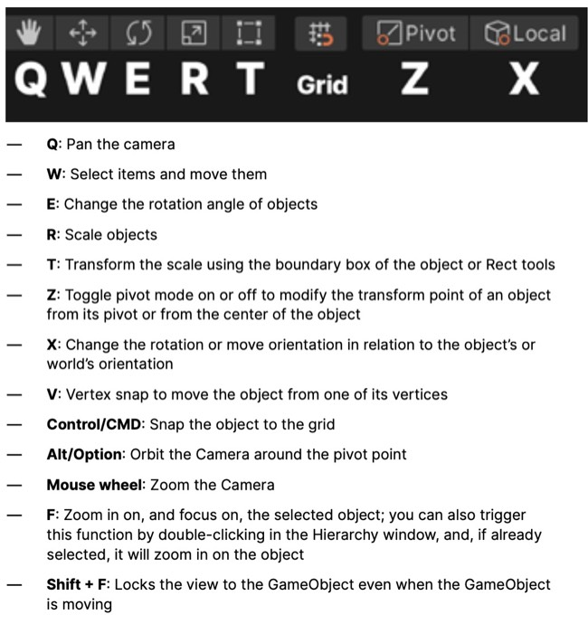
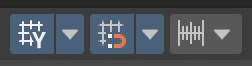
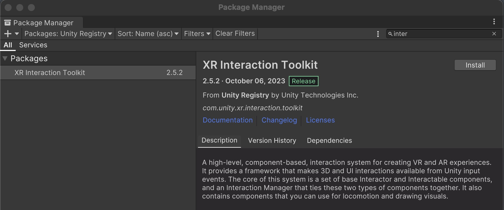
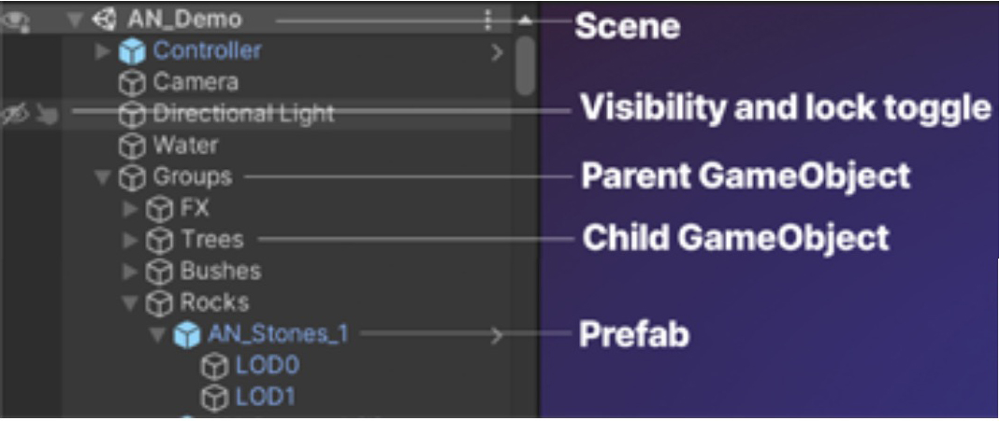

# VRgarden tutorials - Unity basics

1. The Scene Gizmo let you know in which direction you are. You can also select your view by clicking Y/X/Z as it might make it easier to place an object. The camera can also switched between &lt;Persp (perspective) and &lt;Iso (orthographic) when you click on the word.

2. Scene view shortcuts

3. Orbit. Hold Alt (Windows) or Option (macOS), and left-click and drag to orbit the Camera around the current pivot point. For a fast orbit, left-click on the mouse and and press WASD in order to move forward / left / right / back. It’s also a good idea to put cubes in your scene as placeholders so you can easily move from one place to another. If you make those cube 1 x 2m, they also can be use.

4. Game objects. Grid Snapping / Move by increment. Hold down the CMD (Mac) or Control (PC) keys. 
	Shift to constrain the movement to the x/y/z direction.
	Add a plane and a cube to the scene. Hold Control and SHIFT to snap the cube to the plane. Add more cubes so you can easily stack items on top of each other.
	

	
5. The Package Manager is the place where you install and update optional packages. Choose Unity Registry for Unity Packages (such as the XR Interaction Toolkit, OpenXR) or My Assets for the packages used in RosoVRgarden (https://shorturl.at/N9uq1). Click Install or Update depending on your situation.

6. Hierarchy.

