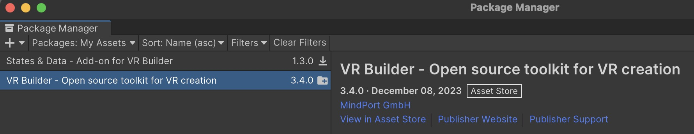
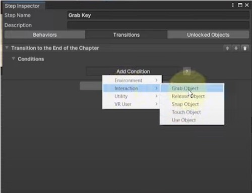
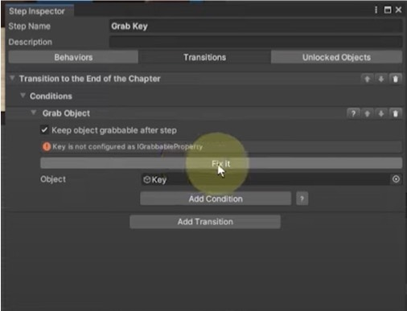
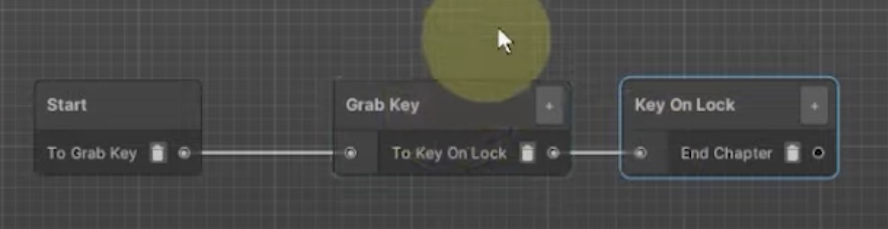
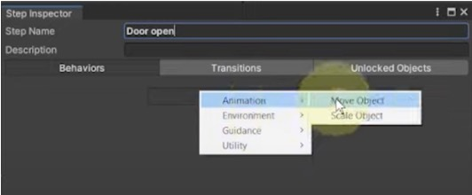
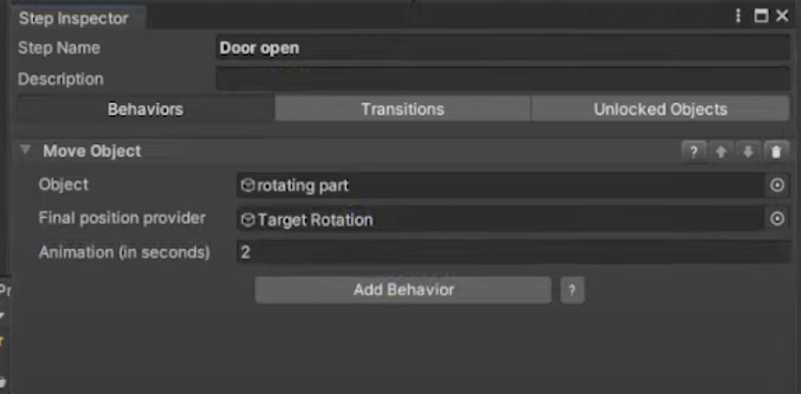
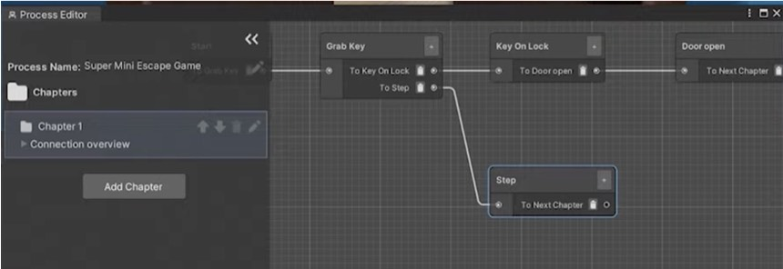
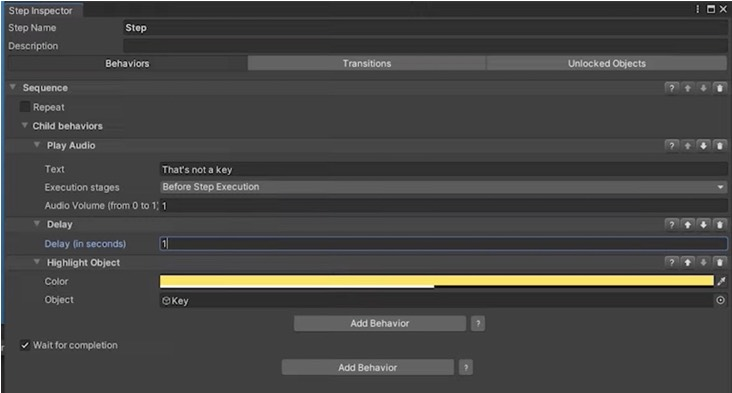

# VRgarden - VR Builder

VR Builder is a tool to easily prototype VR interaction for training or other industrial purposes. It can also be used creatively in order to reduce the amount of code necessary in your application. An example is getting a key (a grabable object), put the key in a keyhole and open the door automatically. In this tutorial, you will learn the basics so you can use this tool and also decide whether it can do what you need.<

1. First. Use the package manager to instal VR Builder and, optionally, another package called States and Data that is available in the VRgarden lab.

2. Once installed, VR Builder can help you setup your project then your scene. Remember that you are using OpenXR. You can either do it at the beginning and open the demo to look at the various possibilities that the package offers. To find the menu again, go to Tools &gt; Project Setup Wizard.

3. After looking at the demo, you can setup your own scene using Tools &gt; Scene Setup Wizard. All parameters are good, click on the Finish button. Then, in process editor, right click, select new and Step. Select the step in the editor and choose a Behaviors / Transitions / Unlocked Objects. Have a look at the possibilities:
 

<table cellspacing="0" cellpadding="0" class="t1">
  <tbody>
    <tr>
      <td rowspan="17" valign="middle" class="td1">
        
<b>Behaviors</b>

      </td>
      <td valign="middle" class="td2">
        
Animation

      </td>
      <td valign="middle" class="td3">
        
<b>Move Object</b>

      </td>
    </tr>
    <tr>
      <td valign="middle" class="td2">
        
 

      </td>
      <td valign="middle" class="td3">
        
Scale Object

      </td>
    </tr>
    <tr>
      <td valign="middle" class="td2">
        
Environment

      </td>
      <td valign="middle" class="td3">
        
Disable Component

      </td>
    </tr>
    <tr>
      <td valign="middle" class="td2">
        
 

      </td>
      <td valign="middle" class="td3">
        
Disable Objects

      </td>
    </tr>
    <tr>
      <td valign="middle" class="td2">
        
 

      </td>
      <td valign="middle" class="td3">
        
Enable Component

      </td>
    </tr>
    <tr>
      <td valign="middle" class="td2">
        
 

      </td>
      <td valign="middle" class="td3">
        
Enable Objects

      </td>
    </tr>
    <tr>
      <td valign="middle" class="td2">
        
 

      </td>
      <td valign="middle" class="td3">
        
Start Particle

      </td>
    </tr>
    <tr>
      <td valign="middle" class="td2">
        
 

      </td>
      <td valign="middle" class="td3">
        
Stop Particle

      </td>
    </tr>
    <tr>
      <td valign="middle" class="td2">
        
 

      </td>
      <td valign="middle" class="td3">
        
Unsnap Object

      </td>
    </tr>
    <tr>
      <td valign="middle" class="td2">
        
Guidance

      </td>
      <td valign="middle" class="td3">
        
<b>Highlight Object</b>

      </td>
    </tr>
    <tr>
      <td valign="middle" class="td2">
        
 

      </td>
      <td valign="middle" class="td3">
        
<b>Play Audio File</b>

      </td>
    </tr>
    <tr>
      <td valign="middle" class="td2">
        
 

      </td>
      <td valign="middle" class="td3">
        
Play Text-to-Speech

      </td>
    </tr>
    <tr>
      <td valign="middle" class="td2">
        
 

      </td>
      <td valign="middle" class="td3">
        
Spawn Confetti

      </td>
    </tr>
    <tr>
      <td valign="middle" class="td2">
        
State and Date (optional)

      </td>
      <td valign="middle" class="td3">
        
Set Value / Trigger ...

      </td>
    </tr>
    <tr>
      <td valign="middle" class="td2">
        
Utility 

      </td>
      <td valign="middle" class="td3">
        
Behaviors Sequence

      </td>
    </tr>
    <tr>
      <td valign="middle" class="td2">
        
 

      </td>
      <td valign="middle" class="td3">
        
<b>Delay</b>

      </td>
    </tr>
    <tr>
      <td valign="middle" class="td2">
        
 

      </td>
      <td valign="middle" class="td3">
        
Set Parent

      </td>
    </tr>
  </tbody>
</table>

 

<table cellspacing="0" cellpadding="0" class="t1">
  <tbody>
    <tr>
      <td rowspan="10" valign="middle" class="td4">
        
<b>Transitions</b>

      </td>
      <td valign="middle" class="td5">
        
Environment

      </td>
      <td valign="middle" class="td5">
        
Move Object in Collider

      </td>
    </tr>
    <tr>
      <td valign="middle" class="td5">
        
 

      </td>
      <td valign="middle" class="td5">
        
Object Nearby

      </td>
    </tr>
    <tr>
      <td valign="middle" class="td5">
        
Interaction

      </td>
      <td valign="middle" class="td5">
        
<b>Grab Object</b>

      </td>
    </tr>
    <tr>
      <td valign="middle" class="td5">
        
 

      </td>
      <td valign="middle" class="td5">
        
Release Object

      </td>
    </tr>
    <tr>
      <td valign="middle" class="td5">
        
 

      </td>
      <td valign="middle" class="td5">
        
<b>Snap Object</b>

      </td>
    </tr>
    <tr>
      <td valign="middle" class="td5">
        
 

      </td>
      <td valign="middle" class="td5">
        
Touch Object

      </td>
    </tr>
    <tr>
      <td valign="middle" class="td5">
        
 

      </td>
      <td valign="middle" class="td5">
        
Use Object

      </td>
    </tr>
    <tr>
      <td valign="middle" class="td5">
        
State and Date (optional)

      </td>
      <td valign="middle" class="td5">
        
Check / Compare

      </td>
    </tr>
    <tr>
      <td valign="middle" class="td5">
        
Utility

      </td>
      <td valign="middle" class="td5">
        
Timeout

      </td>
    </tr>
    <tr>
      <td valign="middle" class="td5">
        
VR User

      </td>
      <td valign="middle" class="td5">
        
Teleport

      </td>
    </tr>
  </tbody>
</table>

4. The most important are the Transitions. In the example above, to grab a key, it’s an Interaction &gt; Grab Object. You can then drag the model of your key from the hierarchy into the menu. If the key doesn’t have an XR grabable, you can add one using <b>Fix it</b>.

5. The next step is to create the area where the key will need to be brought. It’s also a transition, this time it’s a Snap Object transition where you have the object (the Key) and a place to snap it (Snap Zone). You can create a Snap Zone by going to the object in the hierarchy and create a Snap Zone. You can then move the Snap Zone where you need it (the key hole in this situation). 

6. To open a door, it’s a behaviors. Choose the Animation &gt; Move Object. In order to move the object, drag the object into the object field and create an empty object with the transform that carries the value of rotation. Then add the time of the animation (2 s).

7. There could be other objects in the room to grab. If the user makes a mistake, you can tell them by creating an alternative path.

Making a mistake can trigger an audio and highlight the correct object very training style, not recommended).

8. It doesn’t end with one task, you can setup other tasks after this one is finished by creating a new chapter (left) and linking the end of task to that new chapter (process editor)

9. User manual: <a href="https://www.mindport.co/vr-builder-manual/online-documentation">https://www.mindport.co/vr-builder-manual/online-documentation</a>

