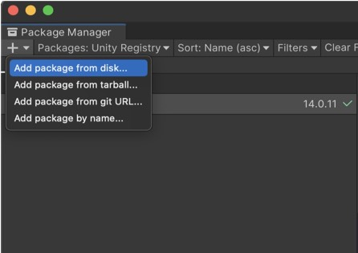
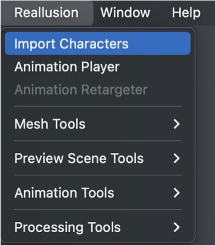

# VRgarden - Character Controller 4:
# from making you character to exporting it to Unity.

<b>Part I - Getting started with Character Controller</b>

(<a href="https://www.youtube.com/watch?v=6U7gr-IVc6U&amp;list=PLNV5zSFadPdkRZZ7WIkctjGd3HD1q8wgE">https://www.youtube.com/watch?v=6U7gr-IVc6U&amp;list=PLNV5zSFadPdkRZZ7WIkctjGd3HD1q8wgE</a>)

<b>Part II - Installing Unity Auto Setup</b>

(<a href="https://www.youtube.com/watch?v=GcjTYAHNe2A">https://www.youtube.com/watch?v=GcjTYAHNe2A</a>)

1. Get the CC Auto Setup. There should be a copy of the file in the common folder but if it’s not there or requires update you can install it yourself.

Go to<b> </b><a href="https://soupday.github.io/cc_unity_tools/installation.html"><b>https://soupday.github.io/cc_unity_tools/installation.html</b></a>

2. Select URP Latest Release:

https://github.com/soupday/cc_unity_tools_URP/releases/

3. Select CC/iC Unity Tools 1.6.x URP14 for Unity 2023.3 or URP17 for Unity 6.000. Click on Source Code to download the program. Unzip it on your computer.

4. In Unity, go to Windows/Package manager and click on + and select add package from disk. Find the folder you have unzipped and select the package.json file. 

The installation will start and you will get a new menu called Reallusion.

<b>Part III Character Export </b>

(source: <a href="https://www.youtube.com/watch?v=EwdMSC8UjSY">https://www.youtube.com/watch?v=EwdMSC8UjSY</a>

1. Once your character is ready and the Unity project is setup, you can export the character from CC4. Go to file &gt; export &gt; clothed character (I’m using Kevin as an example). 

2. In the export dialogue, select <b>Unity 3D</b>, <b>Mesh and Motion</b>, <b>Current Animation (ALL)</b>, <b>Delete Hidden faces</b> and <b>enable Subdivision Meshes</b>. 

3. Next, import the files from your computer. You should have 4 folders/files. Kevin.fbm, textures, Kevin.fbx and Kevin.json.

4. Go to the Reallusion menu and select import character. You will have series of option to import your character where Reflexive SSR eyes, Two Pass hair and Everything (under features) are the best quality. Then click build material. 

5. You can then drag your character from the prefab folder to the scene (Kevin.prefab).

6. You can tweak the material in the inspector (normal on the skin, roughness, skin colour, hair colour, ...) or tweak the face movements by selecting the CC_Base_Body prefab under Kevin. In the inspector, they are under <i>Blendshape</i>. 

<b>Part IV Import Multiple Animations (or Motions)</b>

(see <a href="https://www.youtube.com/watch?v=tgirPjknAv4&amp;t=57s">https://www.youtube.com/watch?v=tgirPjknAv4&amp;t=57s</a>)

1. You can import multiple animations. Find the animation tab, right click on one of the animation and select find file to locate them on your hard drive. Copy the entire file structure and go to FBX export menu (see 1).

2. Select Unity 3D and only Motion this time. Then go to Custom, click on the folder icone with an arrow and paste the file structure you have just copied. Select the animation(s) that you need and deselect First Frame in Bind Pose option.
3. As you import the FBX in Unity, you need to go to the Rig panel and select Humanoid. import from other avatar and import from other avatar (select Kevin). you can select Kevin and see the motions.  
