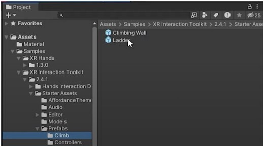

# RosoVRgarden - climbable

## Introduction

1. To make a climbable object (a wall, a ladder or your own) is rather easy but requires many steps. First, make sure that both of your hands have an <b>XR Direct Interactor</b> so you are able to climb with both hands. Then, check the templates in the Assets&gt;Samples&gt;XR Interaction Toolkit &gt; [version] &gt; Starters Assets &gt; Prefabs &gt; Climb for an example. Drag the Ladder Prefab into the RosoVR scene to test.

2. The ladder is organised of 5 parts, the left side, the right side, the handles and the top handle. It’s important that every parts can be accessed individually and are organised in groups of parents / children.

3. The Handles (Climbable) is the parent that contains all the handles. On this object, you will add the Climb Interactable componenent. Only the Y movement is allowed and the collider is set yo volume. Finally, drag the <b>XR Interaction Manager</b> from the hierarchy to the Interaction Manager space.

4. For every handles, make sure that you add a capsule collider (and remove the mesh collider if there is one already).

5. In the XR Origin of your project, create an empty game object and add the <b>Climb Provider </b>component that allows every movement direction (x,y,z).

6. For a ladder, it’s important to extend it as a separate object (the top handle) so the user can move away from it. It doesn’t look very good but it is important for the correct use of VR. Also, you will need to activate the climb settings override on this particular area to allow Y movement (going up/down) but also the Z movement so the user can move back and forward and move onto a platform, for example.<

7. Designing the VR ladder. Although the ladder seems to only fulfil a technical requirement, there are existing design that might be interesting to copy. This is one is from the TV series Hannibal (2013-2015).
