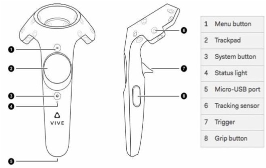
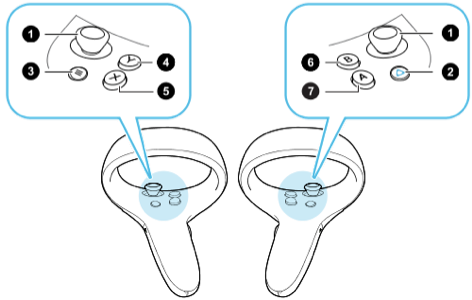
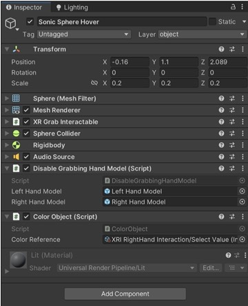
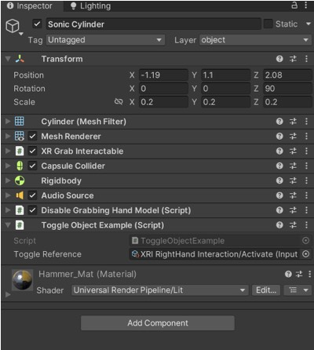
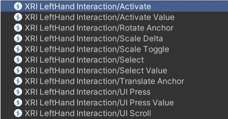

# VRgarden tutorials: Interaction with Controllers

There are many ways of doing interaction with objects and the easiest is through the Direct Interactor (hand) and the Interactable (object) through the event system (select, hover, …). Sometimes, you want to use the joystick to do a specific interaction. It’s not recommended as it is confusing the user between the immersive interaction (diegetic) and the joystick interaction (non diegetic - the controllers are not in the scene, they are outside). However, for professional applications, it can be useful. Here are some information about the names of the controllers parts and how they can be used in Unity with minimal programming.

## Features

<table cellspacing="0" cellpadding="0" class="t1">
  <tbody>
    <tr>
      <td valign="middle" class="td1">
        
<b>Input Feature</b>

      </td>
      <td valign="middle" class="td2">
        
<b>Feature</b>

      </td>
      <td valign="middle" class="td3">
        
<b>Vive</b>

      </td>
      <td valign="middle" class="td4">
        
<b>Oculus</b>

      </td>
      <td valign="middle" class="td5">
        
<b>Unity (default)</b>

      </td>
    </tr>
    <tr>
      <td valign="middle" class="td6">
        
 

      </td>
      <td valign="middle" class="td2">
        
 

      </td>
      <td valign="middle" class="td3">
        
 

      </td>
      <td valign="middle" class="td4">
        
 

      </td>
      <td valign="middle" class="td5">
        
 

      </td>
    </tr>
    <tr>
      <td valign="middle" class="td1">
        
trigger

      </td>
      <td valign="middle" class="td2">
        
Button / Axis

      </td>
      <td valign="middle" class="td3">
        
Trigger

      </td>
      <td valign="middle" class="td4">
        
Trigger

      </td>
      <td valign="middle" class="td5">
        
I / Activate

      </td>
    </tr>
    <tr>
      <td valign="middle" class="td1">
        
grip

      </td>
      <td valign="middle" class="td2">
        
Button / Axis

      </td>
      <td valign="middle" class="td3">
        
Grip

      </td>
      <td valign="middle" class="td4">
        
Grip

      </td>
      <td valign="middle" class="td5">
        
I/ Select

      </td>
    </tr>
    <tr>
      <td valign="middle" class="td1">
        
 

      </td>
      <td valign="middle" class="td2">
        
 

      </td>
      <td valign="middle" class="td3">
        
 

      </td>
      <td valign="middle" class="td4">
        
 

      </td>
      <td valign="middle" class="td5">
        
 

      </td>
    </tr>
    <tr>
      <td valign="middle" class="td1">
        
primaryButton

      </td>
      <td valign="middle" class="td2">
        
Button

      </td>
      <td valign="middle" class="td3">
        
System button

      </td>
      <td valign="middle" class="td4">
        
Primary (X/A)

      </td>
      <td valign="middle" class="td5">
        
 

      </td>
    </tr>
    <tr>
      <td valign="middle" class="td7">
        
secondary Button

      </td>
      <td valign="middle" class="td2">
        
Button

      </td>
      <td valign="middle" class="td3">
        
n/a

      </td>
      <td valign="middle" class="td4">
        
Alternative (Y/B)

      </td>
      <td valign="middle" class="td5">
        
 

      </td>
    </tr>
    <tr>
      <td valign="middle" class="td1">
        
 

      </td>
      <td valign="middle" class="td2">
        
 

      </td>
      <td valign="middle" class="td3">
        
 

      </td>
      <td valign="middle" class="td4">
        
 

      </td>
      <td valign="middle" class="td5">
        
 

      </td>
    </tr>
    <tr>
      <td valign="middle" class="td7">
        
gripButton 

      </td>
      <td valign="middle" class="td2">
        
Button

      </td>
      <td valign="middle" class="td3">
        
Grip Press

      </td>
      <td valign="middle" class="td4">
        
Grip Press

      </td>
      <td valign="middle" class="td5">
        
 

      </td>
    </tr>
    <tr>
      <td valign="middle" class="td7">
        
triggerButton

      </td>
      <td valign="middle" class="td2">
        
Button

      </td>
      <td valign="middle" class="td3">
        
Trigger Press

      </td>
      <td valign="middle" class="td4">
        
Trigger Press

      </td>
      <td valign="middle" class="td5">
        
 

      </td>
    </tr>
    <tr>
      <td valign="middle" class="td7">
        
 

      </td>
      <td valign="middle" class="td2">
        
 

      </td>
      <td valign="middle" class="td3">
        
 

      </td>
      <td valign="middle" class="td4">
        
 

      </td>
      <td valign="middle" class="td5">
        
 

      </td>
    </tr>
    <tr>
      <td valign="middle" class="td1">
        
primary2DAxisClick

      </td>
      <td valign="middle" class="td2">
        
Button

      </td>
      <td valign="middle" class="td3">
        
Trackpad-Press

      </td>
      <td valign="middle" class="td4">
        
Joystick-Press

      </td>
      <td valign="middle" class="td5">
        
I/ Scale Toggle

      </td>
    </tr>
    <tr>
      <td valign="middle" class="td1">
        
primary2DAxisTouch

      </td>
      <td valign="middle" class="td2">
        
Axis

      </td>
      <td valign="middle" class="td3">
        
Trackpad-Touch

      </td>
      <td valign="middle" class="td4">
        
Joystick-Touch

      </td>
      <td valign="middle" class="td5">
        
L/ Move

      </td>
    </tr>
    <tr>
      <td valign="middle" class="td1">
        
 

      </td>
      <td valign="middle" class="td2">
        
 

      </td>
      <td valign="middle" class="td3">
        
 

      </td>
      <td valign="middle" class="td4">
        
 

      </td>
      <td valign="middle" class="td5">
        
 

      </td>
    </tr>
  </tbody>
</table>

<i>Note: I stands for XRI Interaction and L is stands for XRI Locomotion</i>

## Coding Overview

### Button action (true / false)

	Button action (true / false)
	public InputActionReference toggleReference = null;

	private void Awake(){
		toggleReference.action.started += Toggle;
	}

	private void Toggle(InputAction.CallbackContext context){
		action
	}
	
### Analog action (value)		
	public InputActionReference analogData = null;

	void Update()
	float value = analogData.action.ReadValue<float>();
		
## Examples

### ToggleObject (Button)

	using System.Collections;
	using System.Collections.Generic;
	using UnityEngine;
	using UnityEngine. InputSystem;
	
	public class ToggleObjectExample: MonoBehaviour
	{
		public InputActionReference toggleReference = null;

		private void Awake(){
			toggleReference.action.started += Toggle;
		}

		private void OnDestroy (){
			toggleReference.action.started -= Toggle;
		}

		private void Toggle(InputAction.CallbackContext context) {
				bool isActive = !gameObject.activeSelf;
				gameObject.SetActive(isActive);			
			}
		}

### ColorObject (Analog)

	using System.Collections;
	using System.Collections.Generic;
	using UnityEngine;
	using UnityEngine.InputSystem;

	public class ColorObject : MonoBehaviour
	{

  	  public InputActionReference colorReference = null;
  	  private MeshRenderer meshRenderer = null;

  	  void Awake()
  	  {
  		  meshRenderer = GetComponent<MeshRenderer>();
  		}

  	  void Update()
  	  {
  		  float value = colorReference.action.ReadValue<float>();
  			UpdateColor(value);
  	  }

  	  void UpdateColor(float value)
 	   {
  		  meshRenderer.material.color = new Color(value, value, value);
 	   }
	}

5. ColorObject and ToggleObject in the Inspector</b>

6. Next to Color Reference or Toggle Reference, choose XRI LeftHand [RightHand] Interaction /Activate [Select] Value [Nothing]

By default <b>Activate is the trigger</b> (bottom) and <b>Select is the grip button </b>(side) but it can be changed.

Activate value and Select value gives more than true/false states, they give values. Here is a list of the all choices you have under Interaction. Scale Toggle, for example, is the primary2DAxis click.

## Glossary
<table cellspacing="0" cellpadding="0" class="t1">
  <tbody>
    <tr>
      <td valign="middle" class="td1">
        
Term

      </td>
      <td valign="middle" class="td2">
        
Meaning

      </td>
    </tr>
    <tr>
      <td valign="middle" class="td3">
        
Controller

      </td>
      <td valign="top" class="td2">
        
A component that turns XR controller input such as a button press into interaction events like hover, or select. Also provides a way to show controller models and send haptic feedback to the controller.

      </td>
    </tr>
    <tr>
      <td valign="middle" class="td4">
        
Interactor (hands)

      </td>
      <td valign="middle" class="td2">
        
An object in a scene that can select or move another object in that scene. See Direct / Ray Interactor.

      </td>
    </tr>
    <tr>
      <td valign="middle" class="td5">
        
Interactable

      </td>
      <td valign="middle" class="td2">
        
An object in a scene that the user can interact with (grab it, press it, or throw it). 

      </td>
    </tr>
    <tr>
      <td valign="middle" class="td4">
        
Hover

      </td>
      <td valign="middle" class="td2">
        
The state where an Interactor is in a valid state to interact with an object. This differs between Ray and Direct interaction.

      </td>
    </tr>
    <tr>
      <td valign="middle" class="td5">
        
Select

      </td>
      <td valign="middle" class="td2">
        
The state where an Interactor is currently interacting with an object.

      </td>
    </tr>
    <tr>
      <td valign="middle" class="td4">
        
Interaction Manager

      </td>
      <td valign="middle" class="td2">
        
A manager component that handles interaction between a set of Interactors and Interactables.

      </td>
    </tr>
    <tr>
      <td valign="middle" class="td5">
        
Gesture

      </td>
      <td valign="middle" class="td2">
        
Sequences of movements that translate into an action that manipulates an interactable.

      </td>
    </tr>
    <tr>
      <td valign="middle" class="td6">
        
Haptic

      </td>
      <td valign="middle" class="td2">
        
Sensory or visual stimuli that is sent to the user to give feedback for interaction.

      </td>
    </tr>
  </tbody>
</table>

