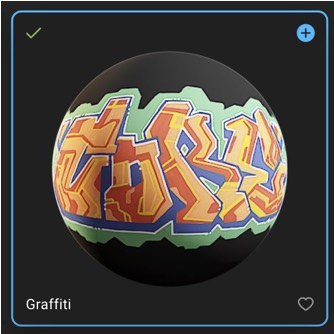
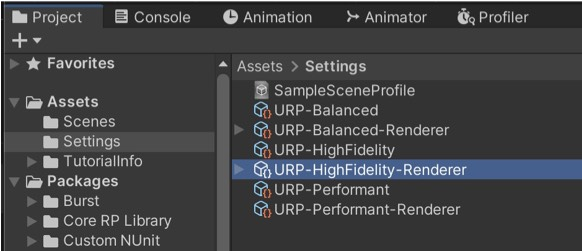
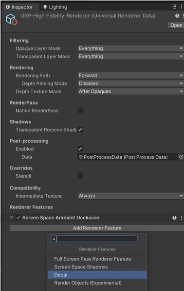
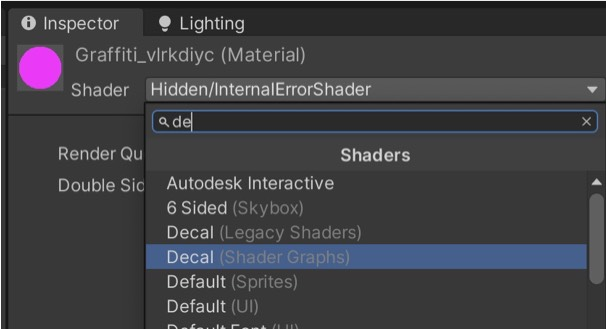
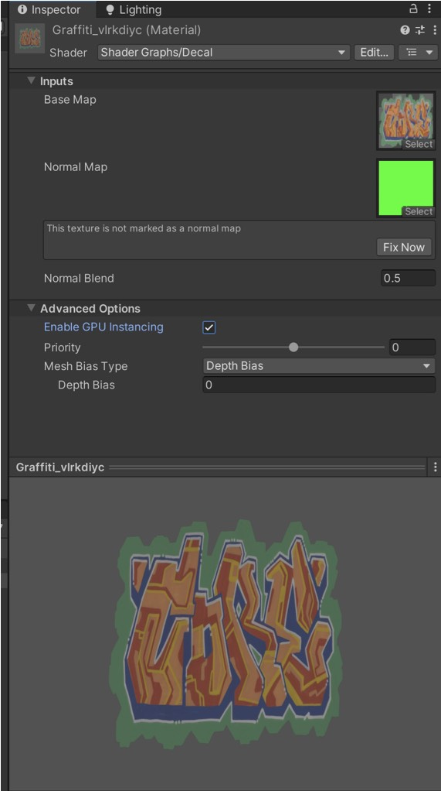
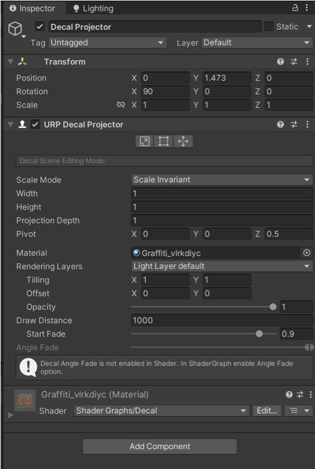
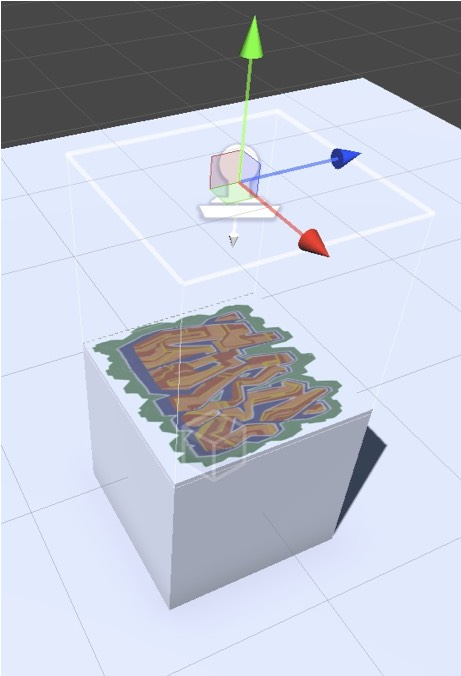

# VRgarden tutorials: decal

1. Decal are materials that you use in play mode in order to make objects react interactively. For example, if you shoot on something, you can use a decal to simulate the hole of the bullet on a material. They require a few steps to setup and might cause some lagging in your rendering time, so watch out your FPS !

2. Download and export a decal from Quixel Megascan such as a Graffiti (not bigger than 2K).

3. In the Assets, choose setting and select URP-HightFidelity.

4. In the inspector, Add Renderer Feature and choose Decal.

5. Find the Graffiti material and choose Decal (Shader Graphs)

6. Move the albedo to Base Map and the Mask to Normal Map and click Fix Now. It’s also recommended to enable the Advanced Options using the Enable GPU Instancing.

7. In the GameObject menu, choose Rendering &gt; URP Decal Projector.

9. Options. Place your Graffiti in the Material, then you have three option to adjust, the projection (width, height and depth), the second one is to crop the image and and third is to adjust the offset (so you can have all the Decal in one image and select one specific one in this projector for better rendering time).

10. Place the projector (the stamp looking object) close to a 3D object, adjust the option if necessary and that’s it.

