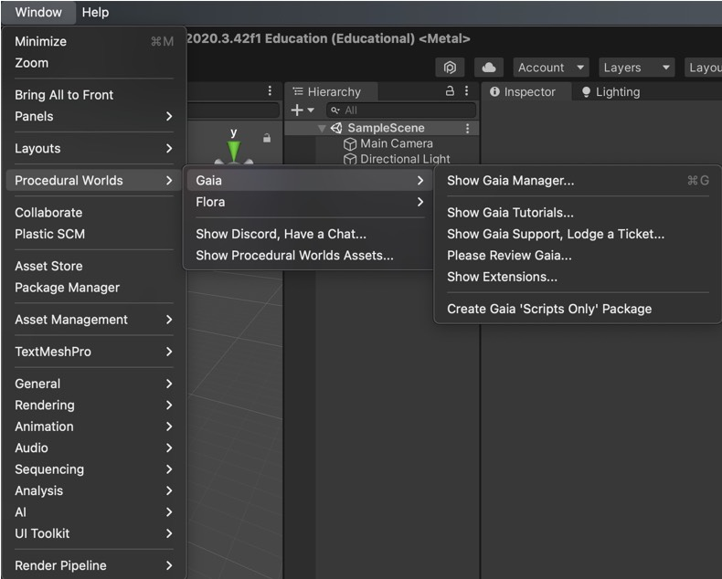
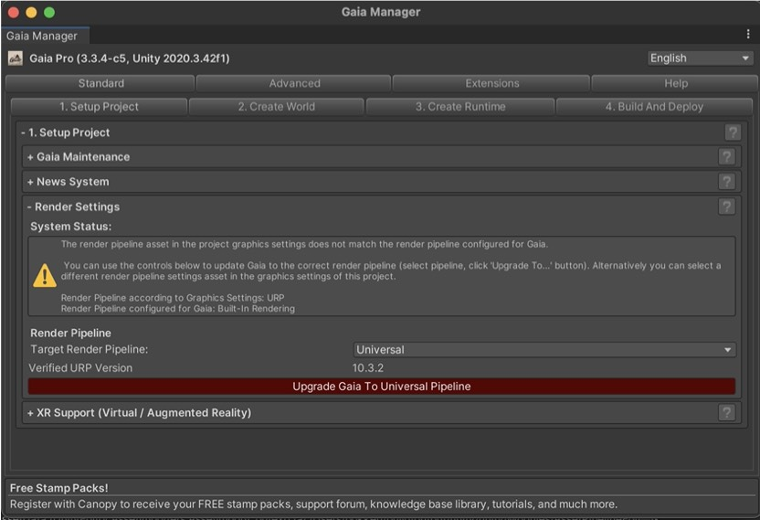
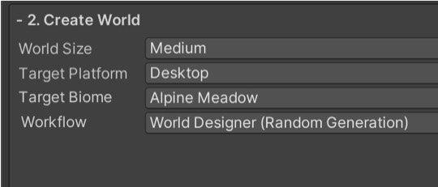
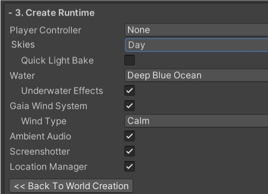
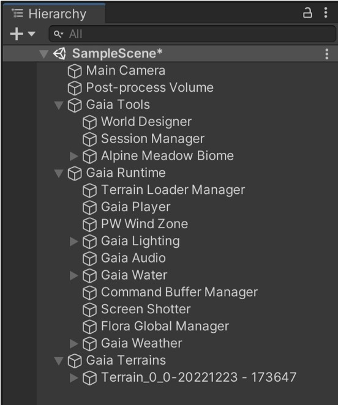

# VRgarden tutorials: Gaia Pro

Gaia Pro is an alternative to Unity Terrain that is optimised for terrain with water, sounds, flowers and trees. The setup is much easier than Unity Terrains and can lead to better results very quickly. The setup and the moficiation

1. Go to the Package Manager, download Gaia Pro and import in your project (URP).

2. Go to Window &gt; Procedural Worlds &gt; Gaia &gt; <b>Show Gaia Manager...</b>

3. In the first menu, <b>1. Setup Project</b>, click ‘Upgrade Gaia to Universal Pipeline’ (then say yes to all, use Gaia RP asset, Set up Terrain Material,...)

4. Then click on ‘Install Shaders’

5. Select <b>2. Create World</b>. Choose the World Size (Medium), Platform (Desktop is fine if you use VR from a Desktop or choose VR if you need to run on the Oculus as Wireless), Target Biome (Alpine Meadow for Mountain).

6. Create Runtime. Player Controller (None), Skies (up to you), Water, Wind Type, …

7. Gaia Pro works through spawners. A spawner is an object in a simulated game world that spawns further objects so rather than drawing yourself, you ask the software to create an environment for you.

8. In Gaia Tools &gt; World Designer, you find the first spawner, <b>Gaia World</b>. In the World Size, you can choose the size and the Sea Level. In the World Shape, you can change the shape or import an image or an existing terrain. In the World Detail you can choose the amount of Plains, Valleys, Mesas, Hills, Mountain, Islands and Rivers.

9. In Gaia Tools, you’ll find the second spawner, <b>Alpine Meadow Biome</b>. A biome is a type of land such as desert, grassland, rain forest, deciduous forest, taiga, and tundra. In Gaia, the main ones are forest and mountain (there are options to add more).

10. In Gai Runtime, you will find the Gaia player (set to none earlier), the PW Wind Zone (control wind), the lighting control.

Vocabulary:
Stamper: a tools that helps you shape your terrain with mountains and valleys

Spawners: places resources such as textures, trees, terrain details (such as grass)

Biomes: the animal and plant life, soil properties and other natural elements that you would expect in an outdoors area according to its climate
