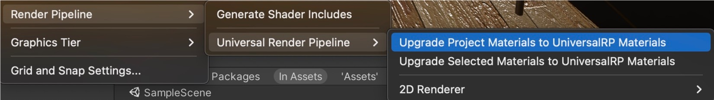
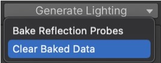
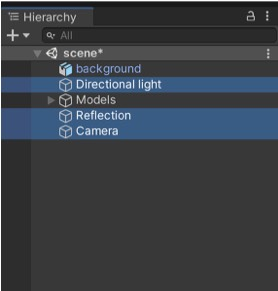
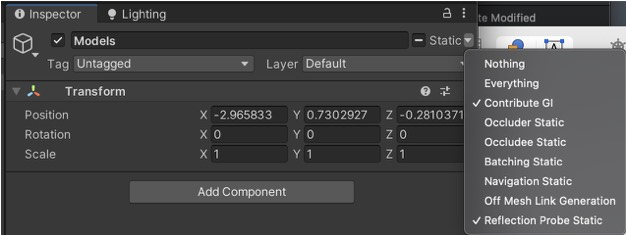
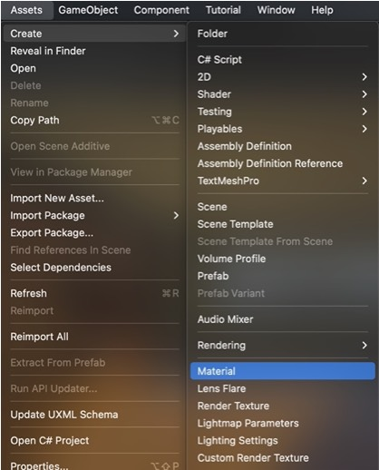
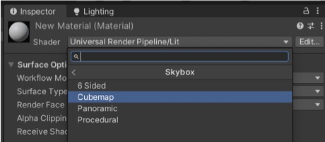
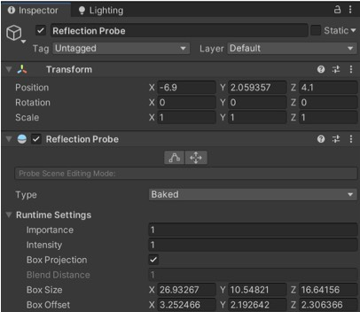
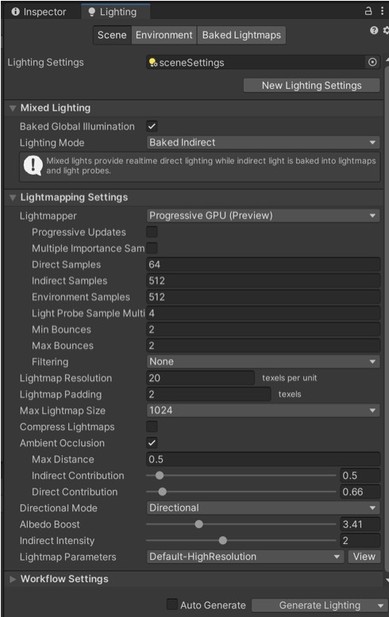
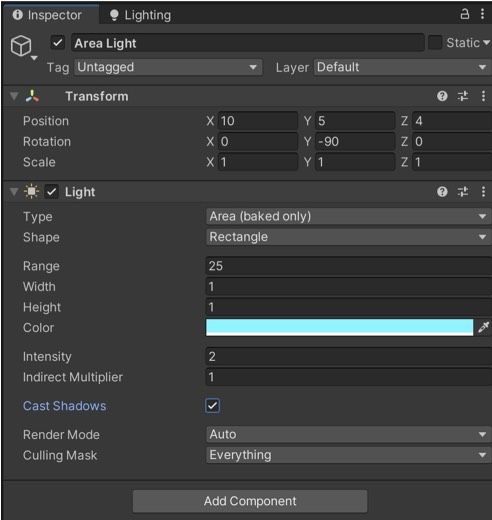

# VRgarden tutorials: Indoor Lighting (Pack Gesta project)

1. Create a new project using the 3D URP template. 

2. Go to the Asset Store and get the [Pack Gesta](https://assetstore.unity.com/packages/3d/props/furniture/pack-gesta-furniture-1-28237?aid=1011ld79j&amp;utm_campaign=unity_affiliate&amp;utm_medium=affiliate&amp;utm_source=partnerize-linkmaker">https://assetstore.unity.com/packages/3d/props/furniture/pack-gesta-furniture-1-28237?aid=1011ld79j&amp;utm_campaign=unity_affiliate&amp;utm_medium=affiliate&amp;utm_source=partnerize-linkmaker) (free)

3. Open the scene called ‘scene’. All will be pink, it’s because the project was done in the basic render pipeline, but it can be changed. In Unity 2020, you need to go to Edit &gt; Render Pipeline &gt; Universal Render Pipeline &gt; <b>Upgrade Object Materials</b>.

4. Open the Lighting tab in Window &gt; Rendering &gt; <b>Lighting</b> (I usually put it in next to the inspector)

at the bottom, click on the arrow next to Generate Lighting and select <b>Clear Baked Data</b>.

5. Delete the <b>Directional Light (DL)</b>, <b>Reflection</b> and <b>Camera</b> from the Hierarchy. 

6. Go to GameObject and add a <b>Camera</b>. Choose the view by moving the camera then, make sure that the camera is selected, and press <b>control-shift-f</b> (command-shift-f on Mac) to copy the scene view position to your camera position.

7. Add <b>Directional Light</b> (GameObject&gt;Light&gt;Direction Light). The position doesn’t matter, use the rotation to place the reflexion of the window in the room (e.g.: Rotation 22, -67, -27). You can choose the colour for the time of day and the intensity (e.g.: 3). 

8. <b>Bake the light</b> in the scene allows you calculate complex lighting and save it into the texture. First change the objects to static (see image below) and check that every object in your scene has been imported with the Generate Lightmap UV’s option (in this example, they have). Find the object in the asset folder.

9. You can see the Lightmap by selecting <b>Shade </b>under<b> </b>the <b>Scene</b> window. Select Baked Lightmap and show <b>Lightmap Resolution</b>. Big squares mean low resolution and small square mean high resolution.

10. You select the resolution in the Lighting tab under lightmap resolution (try 5 then 20) and click <b>Generate Lighting</b> to test. 

11. In order to improve lighting (indirect diffuse and specular lighting), it’s recommended to have good quality lighting environment. Download this HDR file from here <a href="https://polyhaven.com/a/ruckenkreuz">https://polyhaven.com/a/ruckenkreuz</a> (free). The HDR / 2k is well enough in terms of quality. Import in Unity and change the <b>Texture Shape to Cube (1)</b>. Then go to <b>Assets</b> menu and create a <b>Material (2)</b>. Change the shader to <b>Skybox &gt; Cubemap</b> (3) then assign the HDR image to the Cubemap slot (4).

Go to the Lighting tab, select Environment and drag the New Material into Skybox Material and drag the <b>Directional Light</b> to Sun Source.

12. Create a reflexion probe to capture the reflection inside the scene. Move the reflection probe to the center of the scene. Then Click the <b>edit bounding volume </b>button at the top (make sure the Gizmo is on) so you can make the box to the size of the house or slightly larger. Box Projection needs to be one as well.

13. Here are some suggestions for the lighting. You can <b>Generate Lighting</b> to test them.

14. You could also add an Area Light (GameObject&gt;Light) where the light is just outside the window and the orientation (blue) is towards the inside. Range needs to be 25 so it can reach the end of the flat. General Lighting and check the Lightmap by selecting <b>Shade </b>under<b> </b>the<b> Scene </b>window, then Baked Lightmap.

