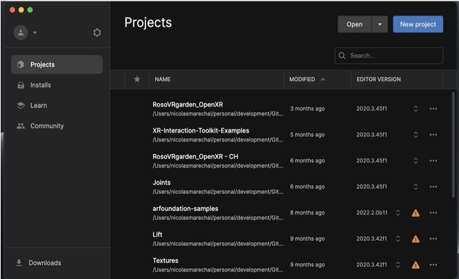
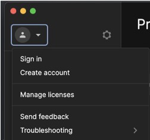
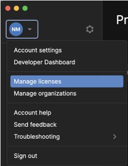
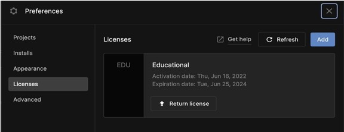
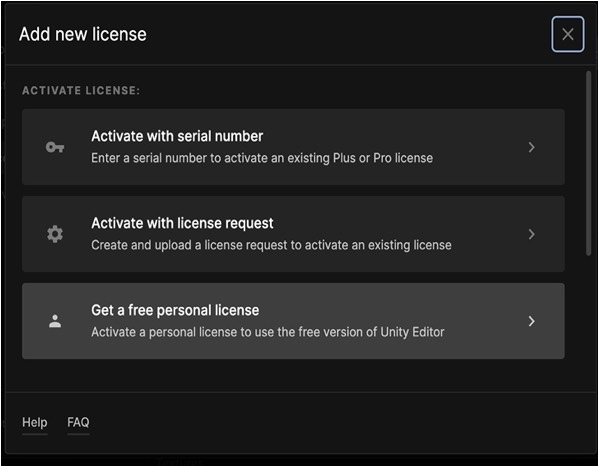
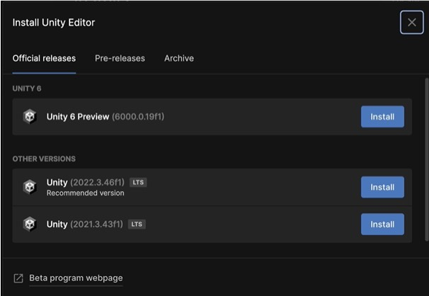
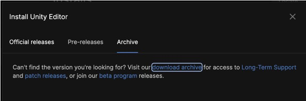
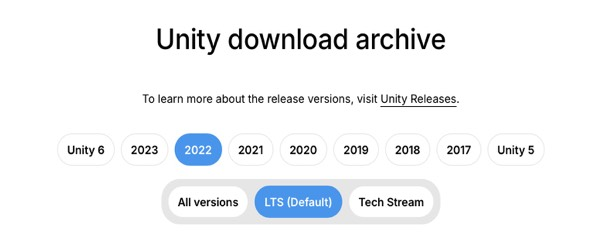

# VR recipe - Install the latest Unity 2022.3+
1. Download the Unity hub here: https://unity.com/download

The hub allows you to create a user, manage your projects and install Unity.  
On the course, we will be using version 2022.3.56.

2. Create an account here and make sure to use your FCU address. dxxxxx@o365.fcu.edu.tw

3. Once you are signed-in, then you can add a free license (only valid one week).

4. Select <b>Licenses</b> on the right, then click on Add. 

5. Get a free personal license (it can be slow, be patient)

6. Once you have a license, click on Installs, then Install Editor.
Install the version used on the computers which is <b>Unity 2022.3.56.</b>

7. If the recommended version is not available anymore, you can get it from the archive (click the tab <b>Archive</b> then <b>download the archive</b>)

