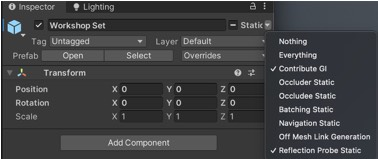
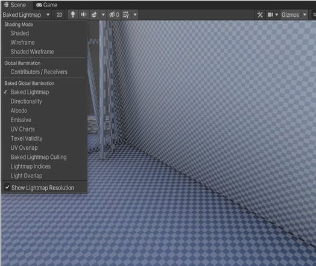
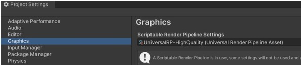
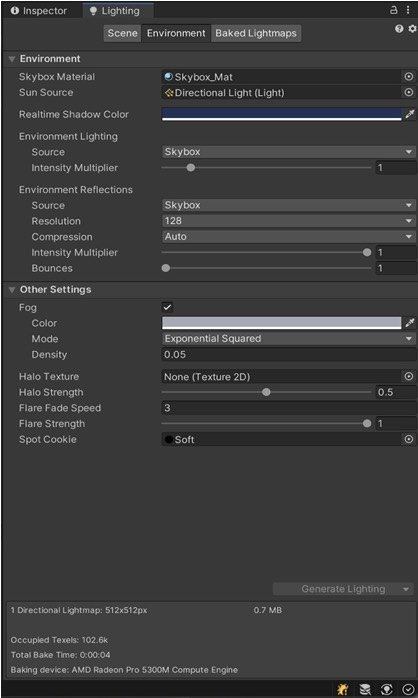
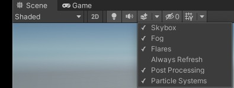

# VRgarden tutorials: Light recipe - Building and Environment

1. Select the ‘Generate UV’ in the import setting of the asset (as well as the collider)

2. Once the building is imported and in the scene, go to the inspector and click on the arrow next to Static, choose Contribute GI and Reflection Probe Static. By doing so, you will allow the light of your building to be ‘baked’ with the texture in order to optimise the lighting.

3. Create a new <b>Directional Light</b> (Gameobject &gt; Light &gt; Directional Light). Use the rotation setting to setup a different time of the day / night. Change the colour for a different mood.
Mode &gt; Mixed
Intensity &gt; how much light do you want?
Shadow &gt; Soft Shadows

4. In the Lighting tab (Window &gt; Rendering &gt; Lighting), create a New Lighting Setting then turn on the ‘Baked Global Illumination’ and select ‘Baked Indirect’ (it the most flexible solution of all three).

Lightmapper Settings &gt; Progress GPU (small scene) or Progress CPU (big scene)
Most of the parameters can be left to default.
Bounce 2 (exterior scene) or 4 (interior scene)
Click ‘Generate Lighting’

5. <b>Lightmap setting</b> of your building is visible by selecting the ‘shaded’ menu under Scene. Select Baked Lightmap and click on ‘Show Lightmap Resolution’. Big square means low resolution and little squares mean higher resolution. You can change the resolution in the Lighting Tab (Scene). Setup low at the beginning and higher for your final version as it takes more time to render.

6. Advanced settings.</b> Go to Edit &gt; Project Settings, select Graphics and click on the Scriptable Pipeline Settings (Universal…). It will highlight the settings in your assets (Assets&gt;Settings is another way to find them).

	
Quality (HDR / MSAA) for smoother rendering (can be an issue with Oculus Quest)
Shadow resolution (up to 2048)
Shadow Distance (up to 100)

7. Sky
The easiest is to import some skies from the asset store (such as AllSky, Wispy Skybox, Fantasy Skybox…).You can make your own sky by creating a material (right click in the assets window). Select the new material, change the name to Sky_Mat then change the shader to skybox &gt; procedural in the inspector.Once it’s done, open the Lighting tab, select Environment and drag the Sky_Mat to Skybox Material and the Direction Light to Sun Source.

8. Fog
In the Environment tab, you can also activate the fog for the scene. Don’t forget to activate the fog in the Scene as well. It’s the double layer with a + sign.

9. Global Volume (postproduction effects)
If you are using the ROSO template, it should be installed already. Otherwise, right-click in the hierarchy search for Volume &gt; Global Volume.
Create a new profile
Add Override to add effects such as Tone-mapping (film effect: ACES), Bloom and Vignette
