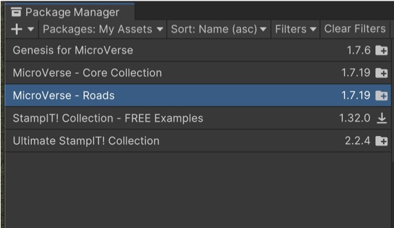
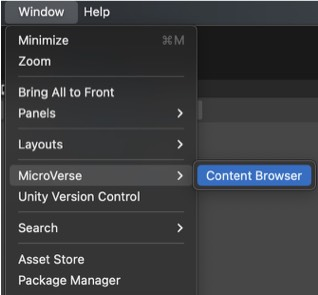
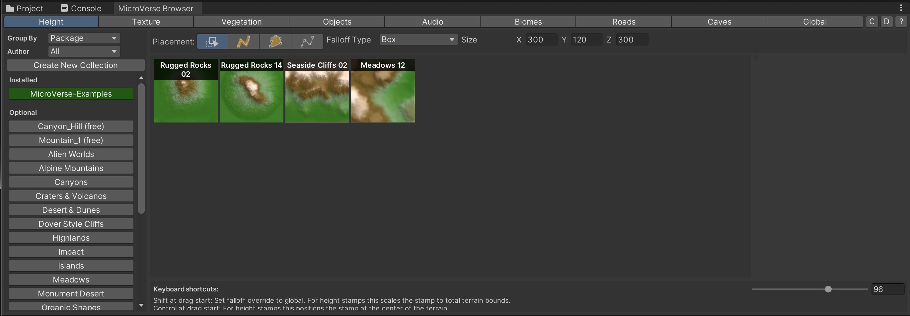
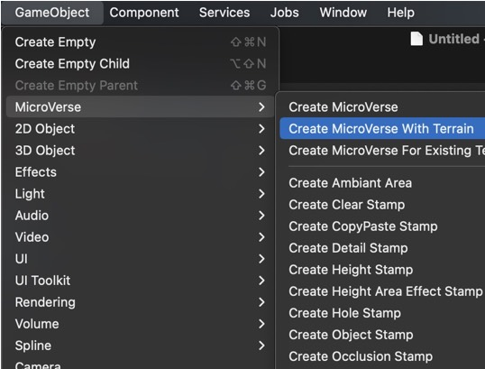
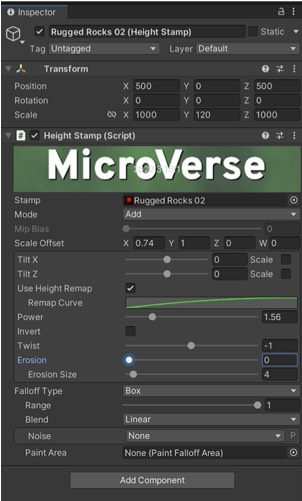
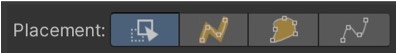

# VRgarden tutorials: Microverse Terrain Generator

[Microverse](https://assetstore.unity.com/packages/tools/game-toolkits/vr-builder-pro-toolkit-for-vr-creation-301706) is a new approach to making terrain that allows you to easily setup a nice looking terrain with roads, textures and trees without dealing a vast amount of data. It can do what terrain can do but it is goal oriented (getting a result fast) and non-destructible (you can easily move stuff around).

1. The essence of the package is in the <b>Microverse - Core</b> Collection. Here is a list of options available Download and import what you need for your project.

- ready made landscapes (stamps): tropical forest pack, ultimate stampIT collection, mountain trees - dynamic nature, landscape ground pack 2

- roads and rails: microverse - roads

2.The first step is to open the Content Browser in the Window&gt;Microverse. Attach the window to the bottom part of the UI (next to Project and Console). You have the following categories that you can follow in order (1. height for the stamps; 2. texture, 3. vegetation). The biomes are similar to Gaia Pro as they contains objects like rocks, texture and vegetation attached.

	

3. In order to use the Microverse Content, create a Microverse with Terrain (GameObject).

4. Drag some content from the heights (the stamps) and place them with the transform tool. For example, use the Rugged Rocks, position 500 0 500 and scale 1000 - 120 - 1000. Then play with the other settings such as remap, power, inverse, erosion, ...

5. Then add some texture (2) which can be for the whole terrain (such as wasteland) or to specific areas (such as desert or alpine).

6. Then add vegetation. You can start with grass which can use the scale tool for a quick selection but has many tools to arrange it smartly around trees or according to the slope. Also part of the vegetations are some trees and rocks.

7. An important tool to notice is the Placement tool. The first is an easy drag and drop into the scene. The second is a spline (a curved line) that allows you place trees (for example) following that line. The third is an area line to concentrate your vegetation in a specific area that you will draw. The fourth is about creating a path using the spline tool.

8. Objects are houses in the basic module and the audio is just birds.

9. Road are, in my opinion, the easiest road system you can find. It does also have rails. I recommend using the spline tool (2) in order to place them in your scene. It’s then really easy to move them around if necessary.<

10. The Global setting gives you a series of option of light from sunrise to sunset. It helps a lot with the lighting of the scene.

11. I recommend watching the tutorials, there are a lot of details that are not covered here. There are some advanced modules such as the Microverse Mask (<a href="https://www.youtube.com/watch?v=pvUI3zNECmY">https://www.youtube.com/watch?v=pvUI3zNECmY</a>) which allows you to put sounds around an irregular lake. It’s an impressive feature but also complex to implement.

Basic: <a href="https://www.youtube.com/watch?v=MoUk0R9XM_w&amp;t=371s">https://www.youtube.com/watch?v=MoUk0R9XM_w&amp;t=371s</a>

Filter system: <a href="https://www.youtube.com/watch?v=J1a2JIKKhqI">https://www.youtube.com/watch?v=J1a2JIKKhqI</a>

Roads: <a href="https://www.youtube.com/watch?v=PI0HSqP78EY">https://www.youtube.com/watch?v=PI0HSqP78EY</a>

Version 1.5: <a href="https://www.youtube.com/watch?v=dVE0DOGrmhg&amp;t=2s">https://www.youtube.com/watch?v=dVE0DOGrmhg&amp;t=2s</a>

