# RosoVRgarden - live characters from Mixamo (Part 1).
1. To create animation with characters, you need <b>a rigged character</b> (1) - a characters with bones that are ready for animation - and some <b>animations</b> that will work with this character (2). You can do it yourself but that’s not the topic of this tutorial.

2. Mixamo (https://www.mixamo.com/) is a repository with free characters and animations. First choose a character (Olivia, for example) and download it in its T-Pose (see step 3). Then go to the animation tab and download some animations that can be gender specific (pink vs blue...). Start with a ‘Walking’, ‘Idle’ and another one such as ‘Jump’ (see step 4). You have some option to make the animation specific to your character.

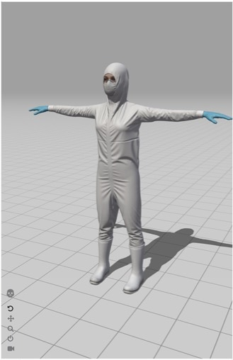
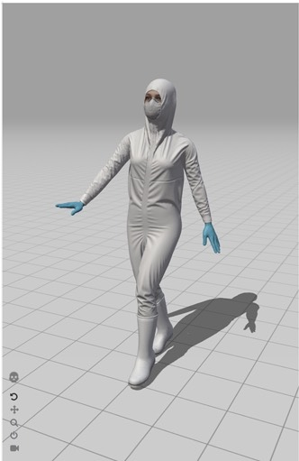

Character’s ‘T-Pose vs Character with an animation applied

3. Download the T-Pose in the FBX for Unity format so you have a neutral character. 

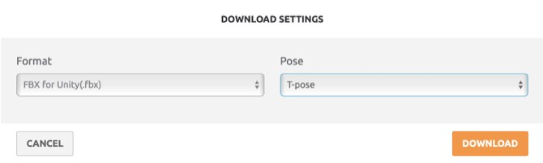

4. Then download the FBX for Unity file of the animations that you require (@walking)

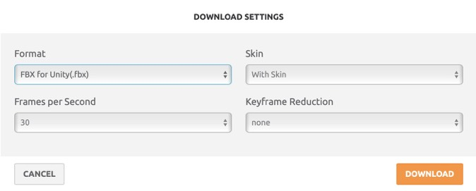

5. Import the character (Ch11_nonPBR, for example) and the animation(s) you have just downloaded (@idle, @walking, @jump, …). Select the character and, in the inspector, choose the Rig tab and select Humanoid as an Animation Type using the Create From this Model.

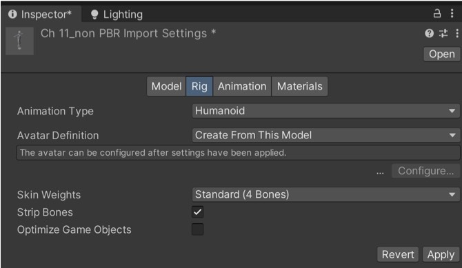

6. In the Materials tab, you need to extract the textures and the materials. Click Extract Textures (1) and select the assets folder in the dialog box. Do the same for the Materials (2). If there is a dialog with anything to fix, click fix. 

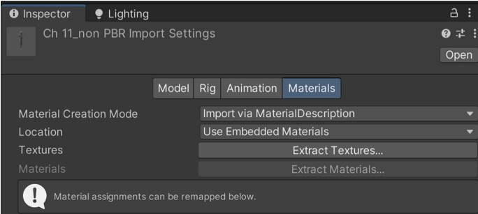

7. Then select the animation in the asset (Ch11_nonPBR@Walking, for example). In the inspector, choose Humanoid in the Rig + Copy from other Avatar in the Avatar Definition. As a Source, choose the original character. Repeat this for all the animations you are importing.

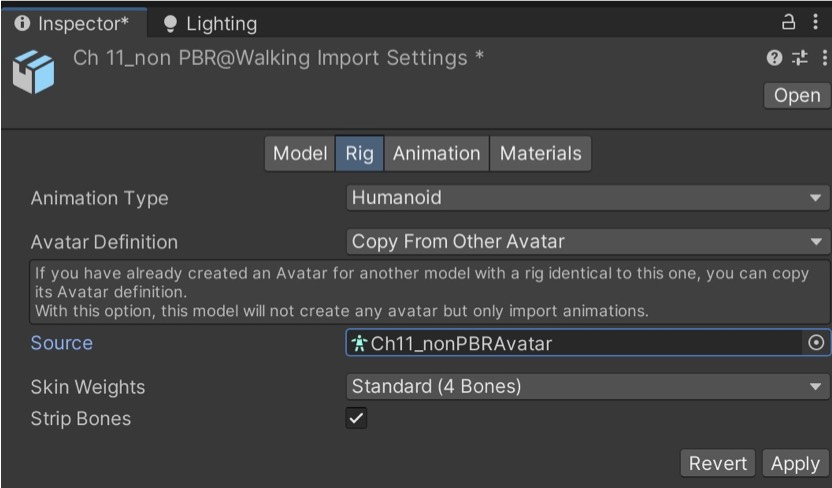

8. Next, we need an animation controller so we can control the animation in Unity. 

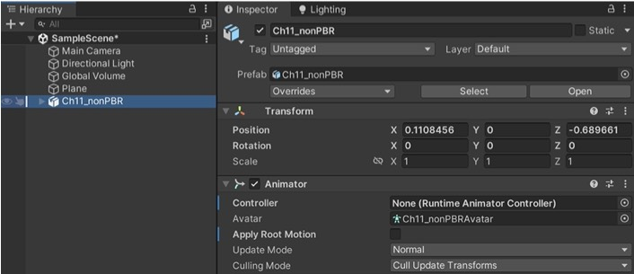

9. Click the + in the asset tab and select an animation controller. Call it <i>Olivia Controller</i>.

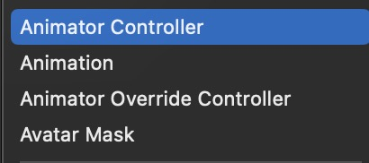
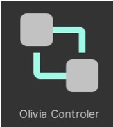

10. Open the controller and drag and drop the @walking animation from the assets. it will create a walking animation (the meaning of this is ‘as you enter the program, start walking’).

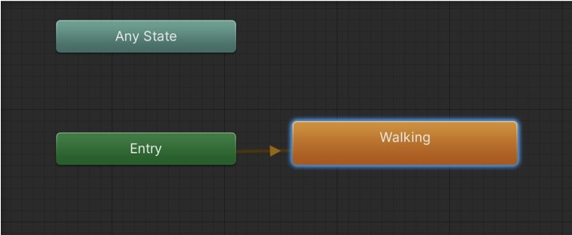

11. Drag the <i>Olivia Controller</i> onto the controller in the hierarchy then press play to see the character of of Olivia with a walking animation.

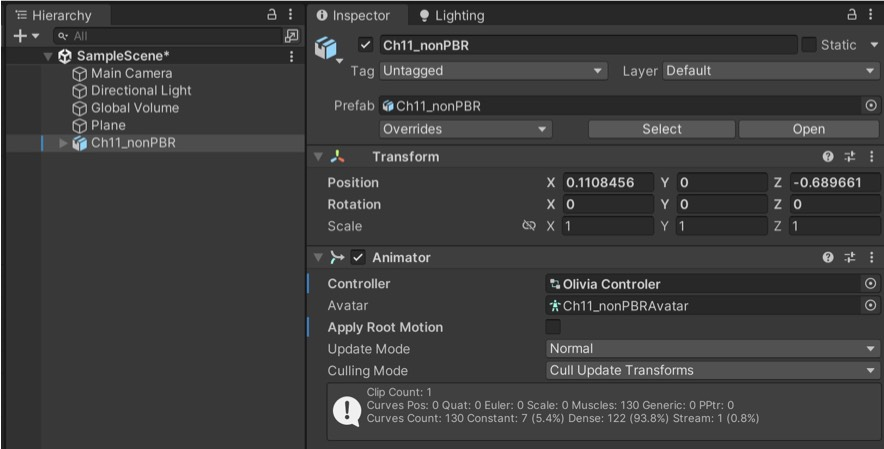

12. Add a script on the character in the hierarchy where you set a new target then request that the animation walk to that new target (you can change the speed and the target).

	using System.Collections;
	using System.Collections.Generic;
	using UnityEngine;

	public class BossController : MonoBehaviour
	{
		Vector3 target;
		float speed = 1.0f;

		void Start()
		{
			SetNewTarget(new Vector3(
				transform.position.x + 3,
				transform.position.y,
				transform.position.z + 3
				));
			}

			void Update()
			{
				Vector3 direction = target - transform.position;
				transform.Translate(direction.normalized * speed * Time.deltaTime, Space.World);
			}
	
			void SetNewTarget(Vector3 newTarget)
			{
				target = newTarget;
				transform.LookAt(target);
			}
		}

<b>More...</b>

While Mixamo has easy to use characters, you can find better characters on the usual websites (Turbosquid, CGtrader, …) or specialist website such as Reallusion (<a href="https://actorcore.reallusion.com/actor">https://actorcore.reallusion.com/actor</a>) which has rigged characters (actors) and compatible animations that you can apply on them. Unfortunately, animations are not always compatible with the rigged characters.

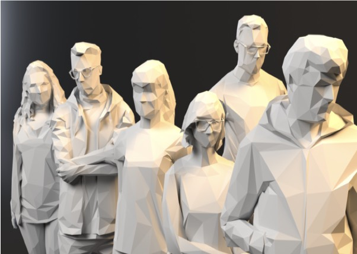

