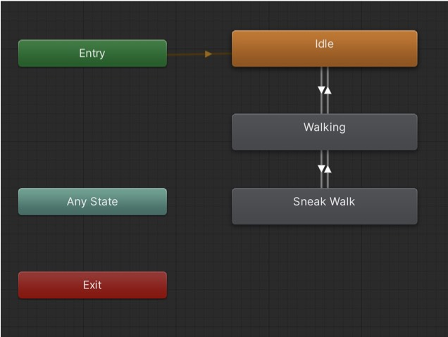
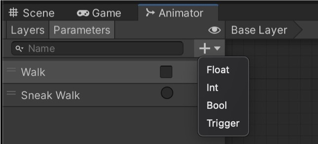
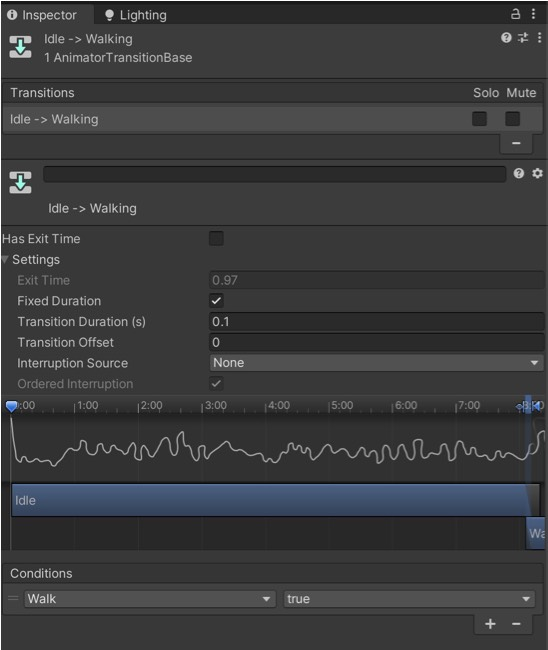
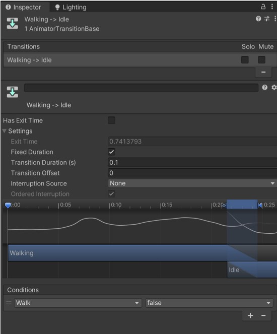
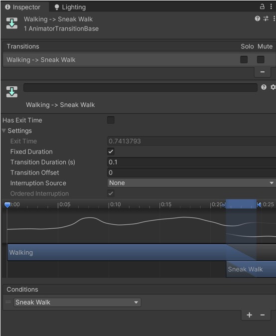
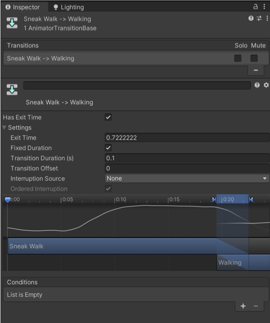

# VRgarden tutorials: Character Animation with Mixamo (Part 2).

1. To change animation, go to the animation controller and link your animation in the following way. Set Idle has a Layer Default State (select Idle then right-click on it and choose from the menu). Between Idle and Walking, then Walking and Sneak Walk, make transitions.

2. In the parameters tab, create two parameters, one is Bool (Walk) 

and the other one is Trigger (Sneak Walk).

3. Select the transition going from <b>Idle to Walking</b>. Toggle off the ‘Has Exit Time’ and change the transition duration to 0.1 (the transition between the two animations). Conditions should be set to Walk True (if the code sends a True message to Walk, then the walk is activated.

4. Select the transition going from <b>Walking to Idle</b>. Toggle off the ‘Has Exit Time’ and change the transition duration to 0.1.

5. Select the transition going from <b>Walking to Sneak Walk (or Jump)</b>. Toggle off the ‘Has Exit Time’ and change the transition duration to 0.1. The conditions is a Trigger and it is the Sneak Walk you have created in step 1. 

6. Select the transition going from <b>Sneak Walk to Walking. </b> This time, keep ‘Has Exit Time’ on (it means, go back to the main animation when finished) and change the transition duration to 0.1.

7.Create the following code that you will attach to the animation in the hierarchy. Compared to the previous, add the following:

1. private Animator animator;

float targetPosition = 4.0f; (at the beginning)

2. _animator = GetComponent&lt;Animator&gt; (); (in Start)

3. if (transform.position.× &gt; targetPosition) { 

-&gt; animator. SetBool ("Walk", false);

else -&gt; animator. SetBool ("Walk", true);

The logic is quite simple, use the walk animation until you have reached the target, then go back to idle.

	using System.Collections;
	using System.Collections.Generic;
	using UnityEngine;

	public class BossController3 : MonoBehaviour
	{
		Vector3 target;
		float speed = 1.0f;
		float targetPosition = 4.0f;
	
		private Animator _animator;

		void Start()
		{
			_animator = GetComponent<Animator>();
		
			SetNewTarget(new Vector3(
				transform.position.x + targetPosition,
				transform.position.y,
				transform.position.z + targetPosition
				));
			}

			void Update()
			{
				Vector3 direction = target - transform.position;
				transform.Translate(direction.normalized * speed * Time.deltaTime, Space.World);
		
				if (transform.position.x > targetPosition) {
					_animator.SetBool("Walk", false);
					} else {
						_animator.SetBool("Walk", true);
						//print (transform.position.x);
					}				
				}
			
				void SetNewTarget(Vector3 newTarget)
				{
					target = newTarget;
					transform.LookAt(target);
				}
			}

8. BossPatrol is a classic in animation, and yet it is very simple. It allows you to set two waypoints so the character will move between these two points. Create two empty Gameobject, place them in the space, then drag them from the hierarchy to the Waypoints in the script.

	using System.Collections;
	using System.Collections.Generic;
	using UnityEngine;

	public class BossPatrol : MonoBehaviour
	{
		Vector3 target;
		float speed = 1.0f;
		float targetPosition = 4.0f;
	
		public Transform[] waypoints;
		private int currentWaypointIndex = 0;
	
		private Animator _animator;

		void Start()
		{
			_animator = GetComponent<Animator>();
			}

			void Update()
			{	
				PatrolBetweenWaypoints();
			}
	
			void PatrolBetweenWaypoints()
			{
				if (waypoints.Length == 0)
				{
					Debug.LogError("No waypoints assigned to the patrol script!");
					return;
				}

				Transform currentWaypoint = waypoints[currentWaypointIndex];
				Vector3 direction = currentWaypoint.position - transform.position;
				transform.Translate(direction.normalized * speed * Time.deltaTime, Space.World);
		
				if (Vector3.Distance(transform.position, currentWaypoint.position) < 0.1f)
				{
					currentWaypointIndex = (currentWaypointIndex + 1) % waypoints.Length;
					_animator.SetBool("Walk", false);
				} else {
					_animator.SetBool("Walk", true);
					transform.LookAt(currentWaypoint.position);
				}
			}
		}	

