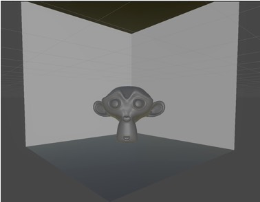
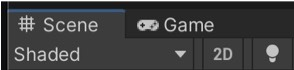
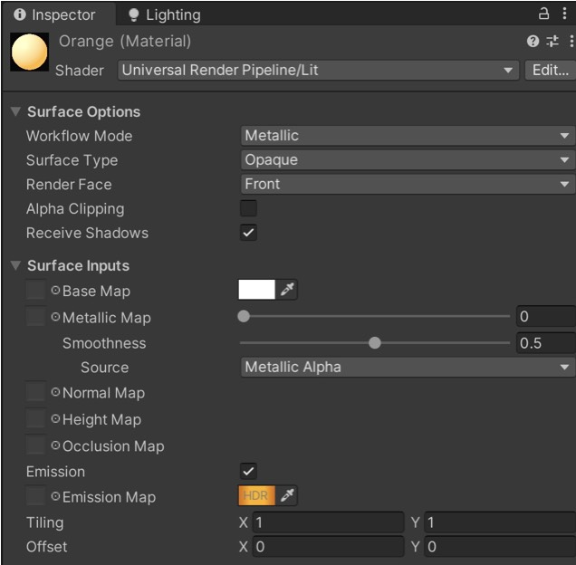
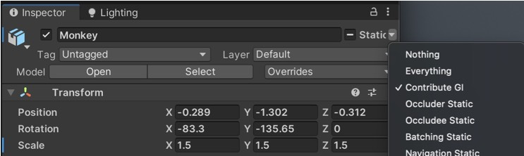
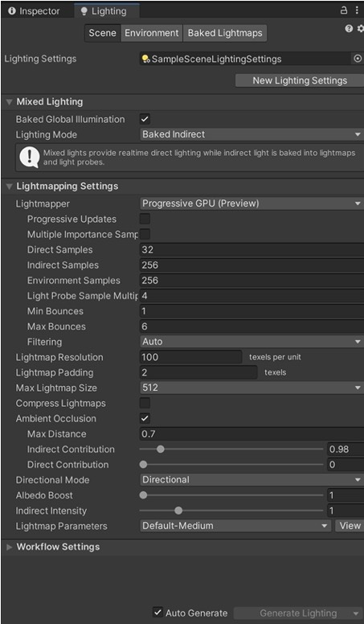
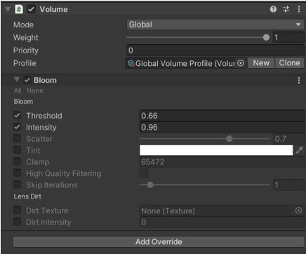

# RosoVRgarden - Emissive Lighting (Monkey project)

1. Create a new project using the <b>3D URP template</b>. 

2. Import Monkey.blend + Room.blend, check that the Generate Lightmap UV is on when you import the monkey and assemble them in the following way;

3. This scene is completely indoor so you can remove <b>Directional Light </b>and in the <b>Lighting Tab </b>(Window&gt;Rendering&gt;Lighting), also remove the Skybox Material and the Sun Source (if any). In the Environmental Lighting, change Ambient Color to black. When there is no more light in the scene, you can turn ON <b>the scene lighting</b> (light bulb in the scene window, next to 2D).

4. Create a <b>plane</b> (scale 0.2) and place it on the right wall behind the monkey.

5. Create a <b>Material</b> (assets&gt;create&gt;material) that you call Orange. Turn on the Emission and change the colour to Orange.

6. In order to re-enable the light, select the <b>static</b> option (Contribute GI) on all the layers and generate lighting (since it’s a small scene, you can toggle the Auto Generate option). 

7.Create another <b>plane</b> (scale 0.2) and place it on the left wall behind the monkey, then create another <b>Material</b> (assets&gt;create&gt;material) that you call Blue. Turn on the Emission and choose a colour close to Blue.

8. Play with in the <b>Lighting Settings</b>.
- Increase the Lightmap size to 512 
- Remove the compression  
- Increase the padding (12) and the resolution (100) if you have any bleeding

9. Add some <b>Ambient Occlusion</b> (shadow between two areas
- Max distance 0.7
- Indirect Contribution 0.1

10. Finally, add a <b>Global Volume</b> (GameObject &gt; Volume &gt; Global Volume).
Click <b>New</b>, then <b>Add Override</b>, and choose Bloom.

