# VRgarden - Unity Navmesh and Intelligent Agents.

1. The Navmesh component allows us to define walkable surfaces for our agent and we’ll use a script that allows them to walk freely in the space. It’s the only way to create autonomous characters for free. First, create a series of cube and arrange them as to create obstacles for your agents. Put them all in one folder (an empty GameObject) called Environment.

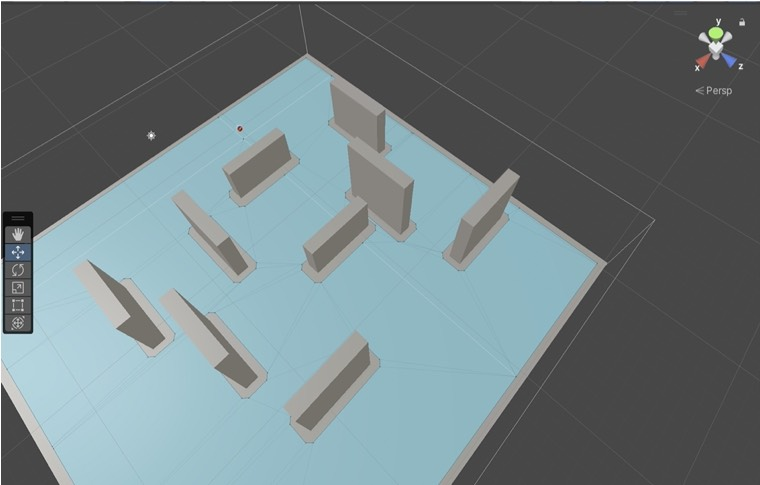

2. Download the AI Navigation from the Package Manager (Unity Registry)

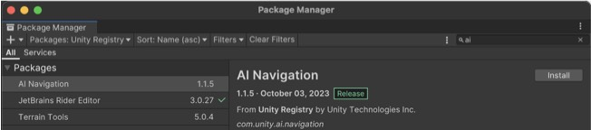

3. Add Navmesh Surface component to your Environment Gameobject and click on Bake. Everytime you change the environment, don’t forget to click on bake.

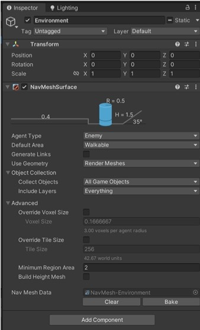

4. Import the NavmeshAnimation.unitypackage. It contains a series of simple characters (male/female), a few standard animations (Humanoid Idle / Walk / Run / Stand Turn) and the Unity StandardClips Controller (see below).

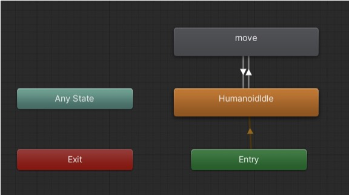
	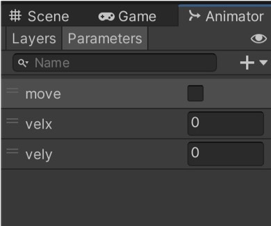

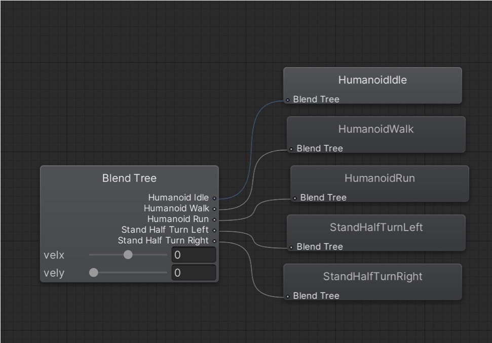

5. To make an animation using a Navmesh is quite tricky. The Unity StandardClips and the Standard animations provide an easy solution (see above). As we enter the game, the Humanoid Idle is activated and when it receives a message from the script (move = true), it enters into an animation blend tree. The tree allows us to animate to blend the walk, run and turn animations depending on the velocity it receives from the Navmesh through the parameters velx and vely.

6. As an example, put the Female Casual in the hierarchy and add the Unity StandardClips Controller to the Controller. Then add a script called PlayerMovement.cs. In the Navmesh Agent, change the Stopping Distance to 0.33 and play with the Radius in case the character becomes stuck too often. The script will synchronise the animation and the navmesh by giving the characters some random places to go.

7. There is a more advanced character called the ‘Dude’ that runs smoother (it has more animations). It uses the LocomotionController as a Controller (see the correct configuration below):

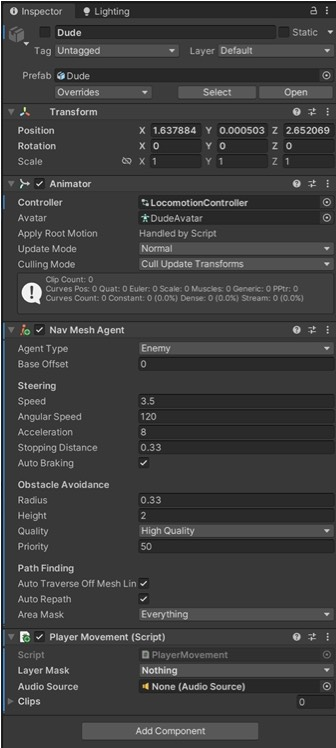

8. You can also import a character such as Olivia from Maximo. Follow the import procedure from the first tutorial, then add the Unity StandardClips to the Controller and the Player Movement script.

9. It’s also possible to define Non-Walkable areas. Create a plane then add a NavmeshSurface. Change the default area to Not Walkable then click on Bake.

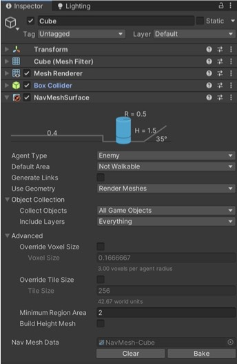

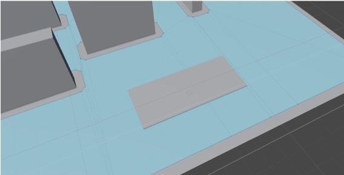

10. There are a few solutions that you can pay for ranging from the NPC Populator ($15) to a complete Urban Traffic simulator with car, buses, bicycle and people ($349). Also check Citizens Pro 2024 ($169) and Population System PRO ($97).

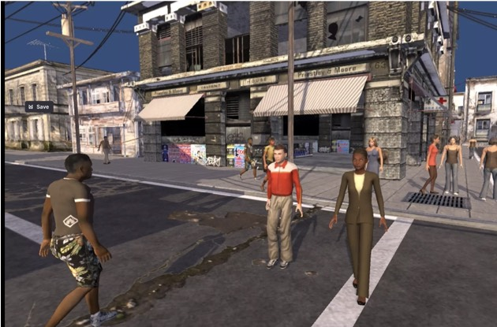

NPC Populator

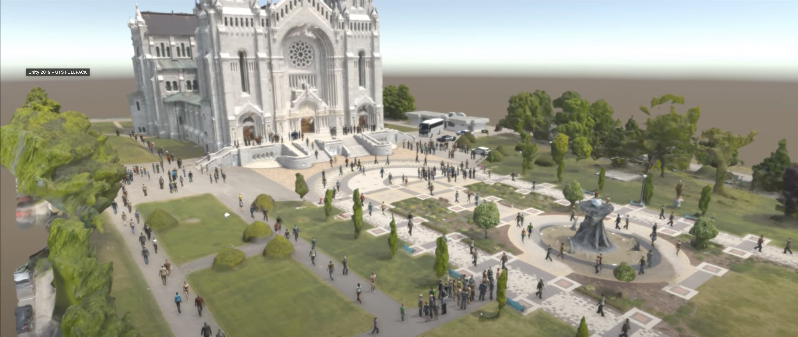

Urban Traffic simulator

11. Acknowledgement. Thanks to Clockworks Games and LlamAcademy tutorials. In particular the tutorial Root Motion NavMeshAgent Animation for the main script (https://www.youtube.com/watch?v=uAGjKxH4sDQ) which gives autonomy to the agents so they can move around on their own in a smooth way. The idea of using Unity’s standard animations and the StandardClips Controller comes from the NPC Populator (Clockworks Games).

12. Further. A* Pathfinder and Behavior Designer are two payware available in the VRGarden. The first is an improvement over patrolling where the characters take different paths. It’s also easier to setup than Navmesh. Behavior Designer allows the creation of a variety of Behaviors depending on the characters positions and relation towards one another.

