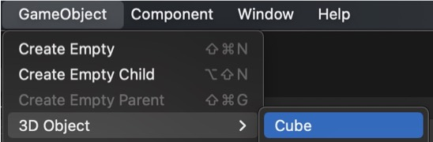
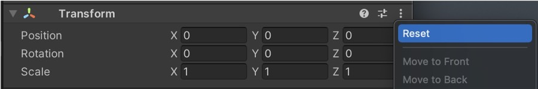
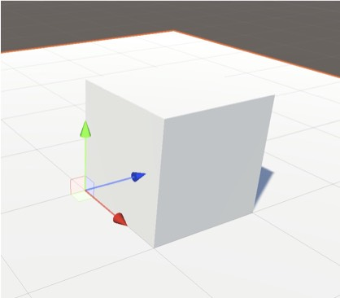

# VRgarden tutorials - pivot
 
1. As an example, create a Cube, the pivot is at the centre (GameObject &gt; 3D Object)

2. Then create an empty object, call it ‘Pivot’ (GameObject &gt; 3D Object)

3. Make sure they are both at [0, 0, 0] or reset their position (3 dotted menu)

4. Put the Cube in the Pivot layer (make it a child)

5. Cube is 1 and situated in the centre so move it by 0.5 on X / Y / Z axis

6. Check the Pivot layer, it should be at the bottom, on the edge of cube

7. If you scale / rotate the Pivot layer, it will scale / rotate from the new pivot

