# VRgarden tutorials: Real World Terrain + Gaia Stampers + Digger

This tutorial teaches you a series of Unity assets and how to combine them so you can use satellite image to get a snapshot of your site, then transfert the result into a terrain assets so you can edit the site and finally learn how to dig into that site. You can use the tutorial partially or in its totality. 

1. Install the [Real World Terrain Helper](https://assetstore.unity.com/packages/tools/terrain/real-world-terrain-8752) + [Gaia Pro](https://assetstore.unity.com/packages/tools/terrain/gaia-pro-2023-terrain-scene-generator-263149) from the Package Manager

2. Open Real World Terrain

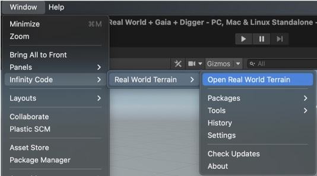

3. Select: Run the helper

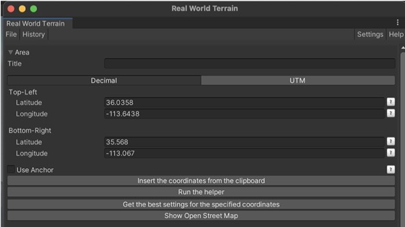

4. Find your location (‘Taichung’ for example) and click Place Selector

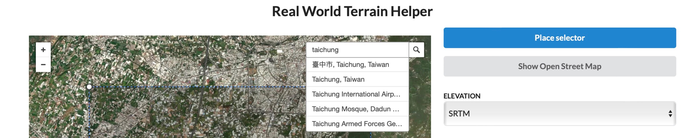

5. Choose Elevation Data (SRTM is free and Mapbox needs registering)

6. Copy the coordinates to the clipboard

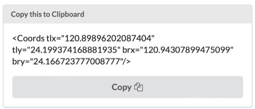

7. Back to Unity, click ‘Insert the coordinates form the clipboard’

8. In Terrain, you can choose <b>Terrain</b> as a result if you want to use directly. You can generate buildings, rivers, trees and grass but they are not great. Click <b>Textures</b> to get images of the area. Add the options you require at the bottom. Choose your <b>Elevation Provider</b>.

SRTM (free) - resolution of 90 meters 
Bing (free) - resolution of 90 meters for the US, 900 for the rest of the world 
SRTM30 (needs registration) - resolution of 30 meters 
MapBox (needs registration) - resolution of up to 5 meters 

Once you are ready, click Start (bottom) and wait for the terrain to be generated.

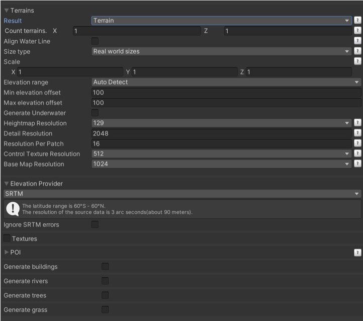

9. Alternatively, if you want better texturing, you can export your terrain into a <b>Gaia Stamp</b>.
Once you are ready, click Start (bottom) and wait for the terrain to be generated.

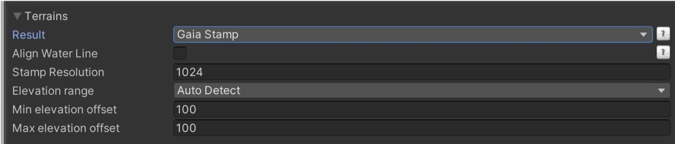

10. In the Hierarchy, under <b>Gaia Tools</b>, you can see Gaia Runtime and Gaia Terrains.

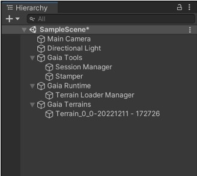

In the Gaia Tools, select the <b>Stamper.</b> If the area is too flat, you can change the scale, for example 100 10 100 in the inspector.

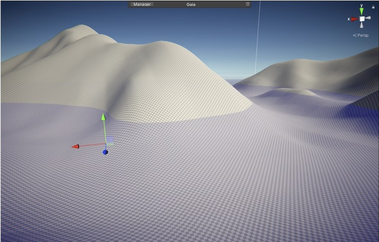

11. Click on the Manager (button above the scene). You will need to
- click Upgrade Gaia to Universal Pipeline (URP). Say yes to all the questions asked.
- click to Install Shaders (accelerate realtime operation).
- no need to install XR, as we use our own XR solution.

12. In order to apply some textures, click Advanced, then Gaia Tools and click on Add Biome. If you have a mountain, click Add Biome, next to Alpine Meadow for example. You terrain will now have some textures. Close Gaia manager.

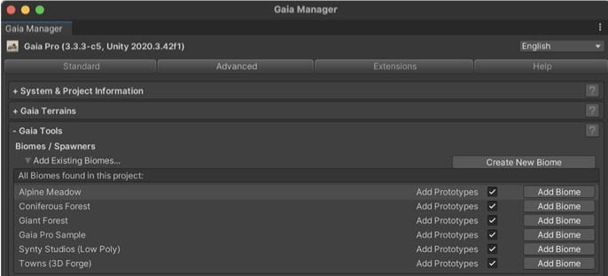

13. In the hierarchy, under Gaia Tools, you will see the Alpine Meadow biome. Select the Spawners that you need (village, stone, mushrooms, trees, bushes, flowers, grass, …). All but the village is good, you can deselect the Village.

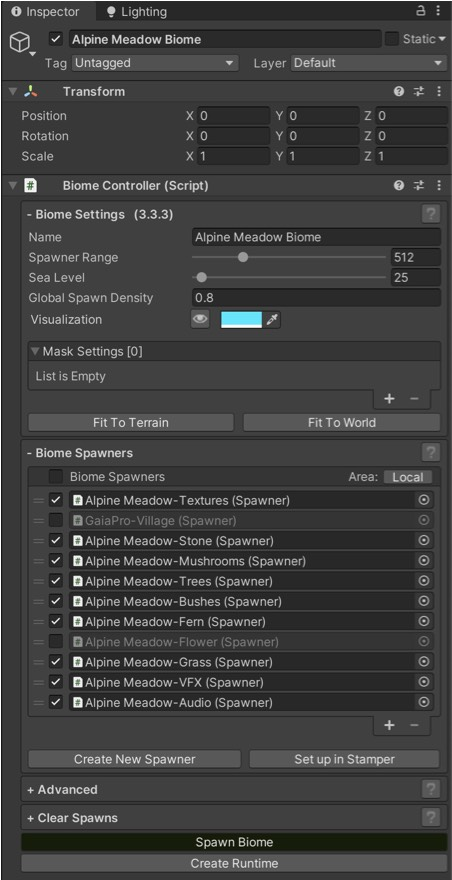

14. When you are ready, click on <b>Spawn Biome</b> (bottom)

15. Then click <b>Create Runtime</b> in order to have moving water, clouds, wind, …. You can change the runtime for a different time of the day in the manager. See [Stamper Introduction](https://canopy.procedural-worlds.com/library/tools/gaia-pro-2021/written-articles/creating_your_world/2-stamper-introduction-r46/)

16. The scene can be particularly big to move around, you may want to add some navigation cubes or install an extension such as Scene Navigator from the package manager to record key positions.

17. To create some digging in the mountain, use the [Digger Pro asset](https://assetstore.unity.com/packages/tools/terrain/digger-pro-voxel-enhanced-terrains-149753). Install Digger Pro from the Assets in the package manager and make sure that Mathematica and Burst are to the latest version in Unity Registry.

18. To use the Digger Pro, go to the new Tools menu, select Digger &gt; Setup Terrains.

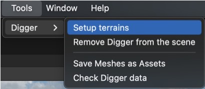

19. Then go to Digger Master (Hierarchy), pick up one of the material and and you can start digging. After digging, you can change the appearance by selecting Paint.

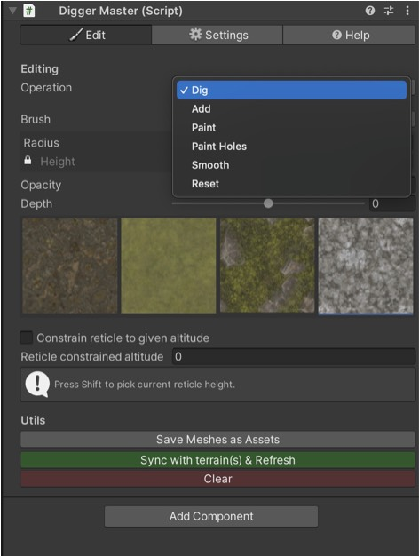

20. The plugin will require that you turn off the Contribute Global Illumination. It’s in the Terrain setting:

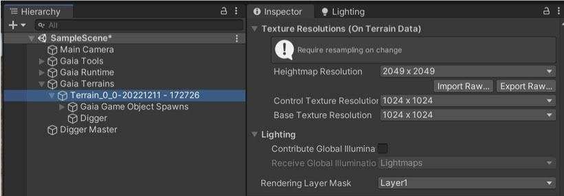

21. Start digging.

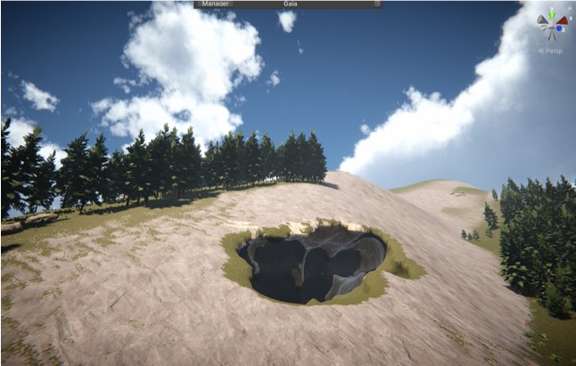

