# VR recipe 1 - OpenXR setup (using Input Action) - Unity 2022.3+

1. Launch the Unity hub and install the latest Unity 2022.3+ (LTS).

2. To start your project, choose a name, location and a render pipeline: at the moment Universal Render Pipeline (URP) is the most efficient and the most compatible. The High Definition pipeline (HDRP) works but is more complicated in terms of setup and most plugins do not work with it.

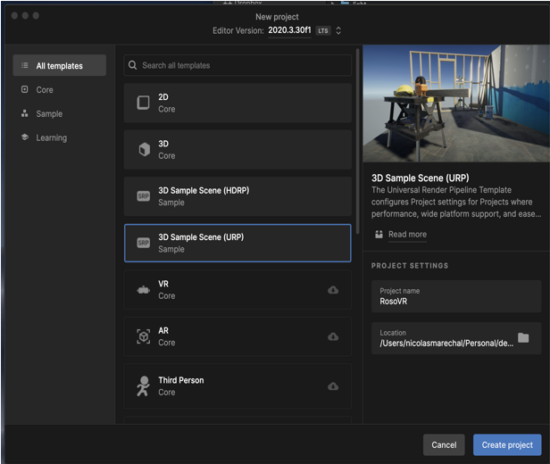

3. Go to the window menu &gt; choose package manager, make sure that you are in the Unity Registry (Unity’s extensions) and type XR in the search window. You will need to install 3 things: the XR Plugin Management / OpenXR and XR Interaction Toolkit (XRI Toolkit).

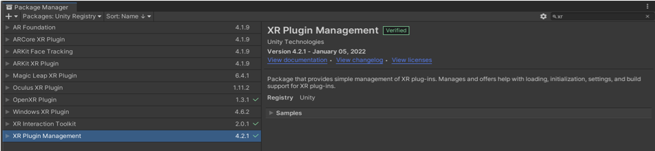

You will get some warnings, about the input system, click YES and Unity will restart.

4. In the Interaction Toolkit, make sure to import the the Starter Assets (inside Samples).

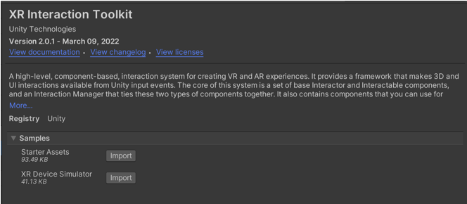

Once you install them, locate them (Assets &gt; XR Interaction Toolkit &gt; 2.X.X &gt; Starter Assets). The image below uses version 2.5.1 but you might have a later version.

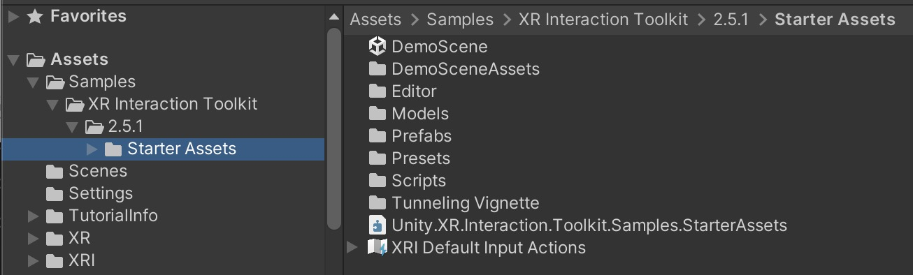

5. Setup OpenXR, go to the Edit menu &gt; Project Settings. OpenXR is Unity system that handles VR and AR. In the XR Plug-in Management, select OpenXR, use Single Pass (more efficient) and add controller profiles. Click + and select <b>HTC Vive Controller</b> and + again to add the <b>Oculus Touch Controller</b> for dual compatibility across the systems.

6. Select on one of the controllers (the right controller, for example), then, in the inspector, click on the preset button (on top, next to the question mark) and click on XRI Default Right Controller.

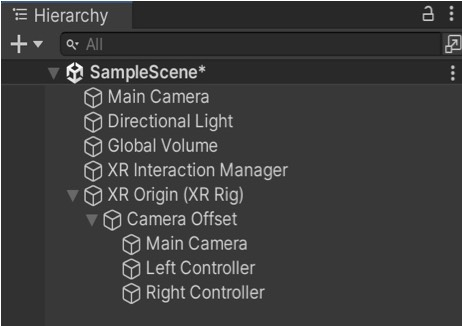

7. You are almost there. Go to the GameObject menu, select XR and XR Origin (VR).

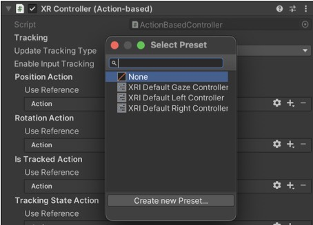

8. One more thing, select the XR Origin (XR Rig) in the hierarchy, find the Input Action Manager, click + then add the XRI Default Input Action (only one choice). You can then click on the play action on top of the Unity window and test if everything works.

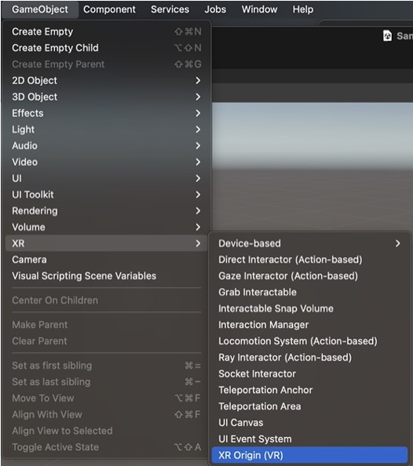

9. In order to add locomotion to your VR, select the XR Origin in the hierarchy and add the following: <b>Locomotion System</b>. <b>Continuous Move Provider (Action-based)</b><b>,</b> <b>Character controller driver</b> and <b>Character Controller</b> by clicking on the Add Component button.<b>
	

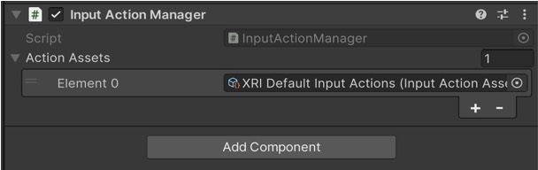

10. In the <b>Continuous Move Provider (Action-based)</b>. Under Right Hand Move Action, click use reference and select XRI RightHand Locomotion/Move (Input Action Reference). Note: Alternatively, you can click +, add binding, click &lt;No Binding&gt;, type ‘Primary’ and select Primary2DAxis [Any]. Both solutions lead to the same result. Select Gravity Application mode ‘Immediately’ so the gravity is applied from the beginning.

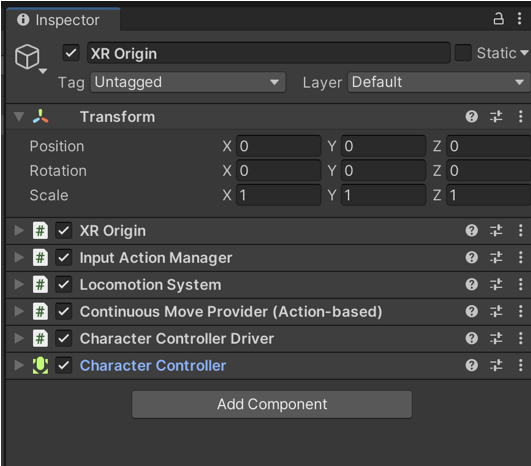

11. Finally, add a sphere under each controller (parenting) so you can see your hands. Make sure to reset their positions or your hands might feel they are in the wrong place (offset or too far).

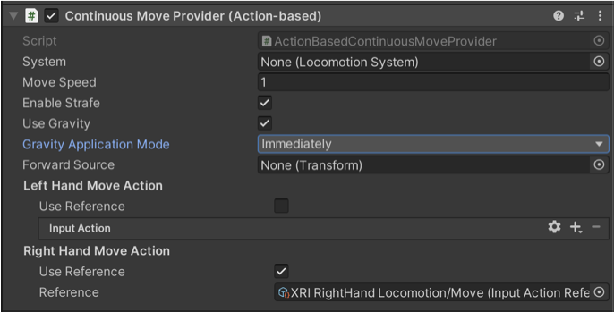
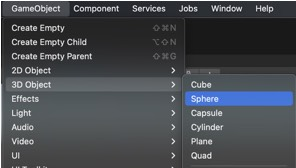
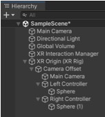
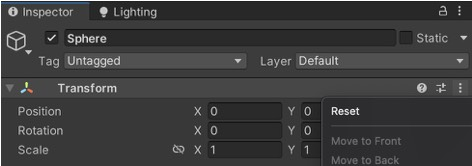

12. For your reference, here are the names of the button for the Vive and the Oculus.

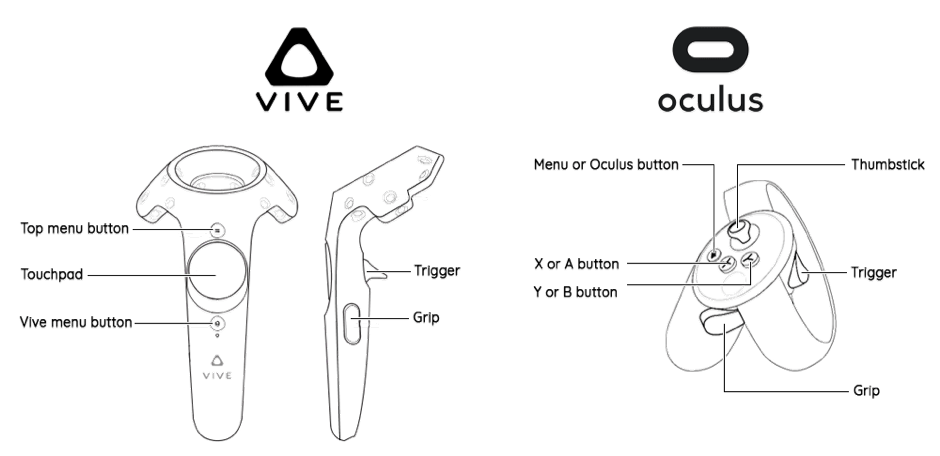

