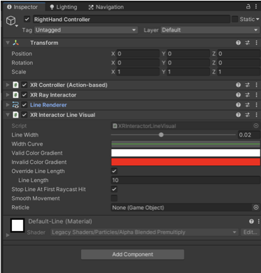
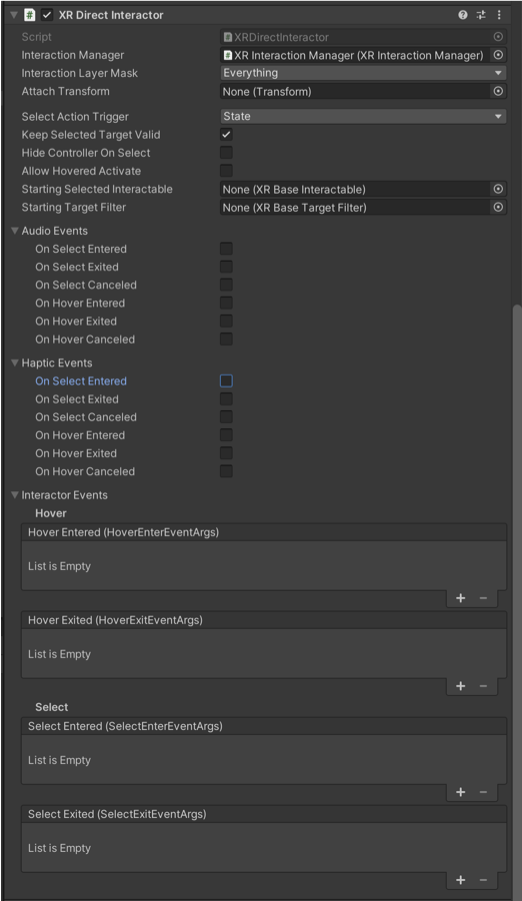
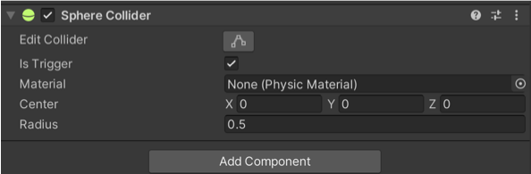
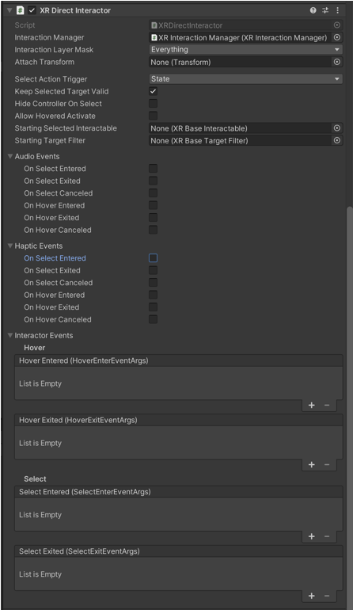

# VR recipe 2: XR Direct Interactor (Simple Hands)

After installing Unity, enabling the XR development, OpenXR, and installing XR Toolkit, we can finally start using VR. The first step is to look at the hands for interaction. As a demo, I choose to have the right hand to interact with object directly (XR Direct Interactor) and the left hand to interact with objects at a distance (XR Ray Interactor).

Under &lt;XR Origin&gt;, you have the RightHand Controller. Remove the &lt;XR Interactor Line Visual&gt;, the &lt;Line Renderer&gt; and the &lt;XR Ray Interactor&gt; (in that order or it will have some issues).

Then add &lt;XR Direct Interactor&gt; so you interact with objects.

Next, you need to add a <b>sphere collider</b> in order to allow interaction with physical objects. Don’t forget to click next to ‘Is Trigger’ so the collider will send a message every time it collides with an other object that has a collider and a rigidbody.<

In the &lt;XR Direct Interactor&gt;, you will find a series of options where you can create an audio or haptic event when you select or hover over an object. There are more complex options available where you can change the colour (the material) of an object without doing any programming.

The layer mask allows you interact with certain objects an not others.

Hide controller on Select is an important one as the controller disappears as you select an object. Since it’s selecting object is not very precise, it allows you to hide the lack of precision when there is an interaction. Since we have changed the Select and Activate action, it will not work, however. In the future, we will write a script to make that feature work again. I will also show you how to make it object specific.
