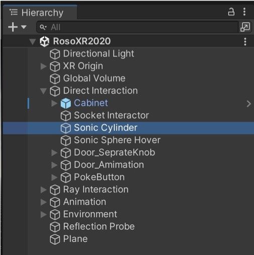
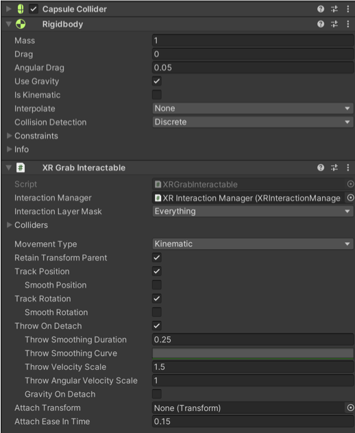
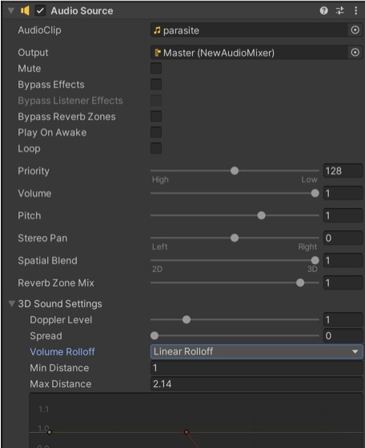
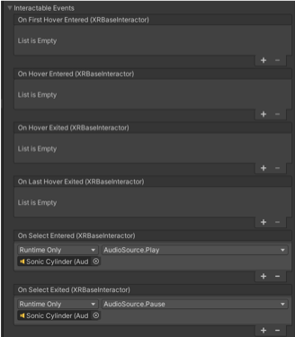

#VR recipe 3: Grab Interactable (Sonic Cylinder)

The sonic cylinder is an object that has physical properties (rigibody) and that plays sound if you select it with your VR hands. Find the <b>sonic cylinder</b> in the hierarchy:

1. Create a 3D game object (a cylinder) then add &lt;XR Grab Interactable&gt; component to get started. It should automatically install a &lt;Rigidbody&gt;. You can choose to have gravity (to fall) or be kinematic (to stay in the air). Make sure that there is a collider attached to your object (there should be one installed automatically). Test it in VR and your object should have an object with physical properties.

Three things: <b>XR Grab Interactable</b> + <b>Rigidbody (physics gravity)</b> + <b>Collider (skin)</b>

2. The sound. Add a &lt;Audio Source&gt; component then import an <i>AudioClip</i> in your assets (I recommend sounddogs.com for reasonably priced professional sounds). Drag the sound from the assets to the <i>AudioClip</i> (example: parasite). Make sure that <i>Play on Awake</i> is off.

3. Go back to the &lt;XR Grab Interactable&gt; component and look for the <i>Interactable Events</i>. You can choose when will the trigger start an event. I have chosen on select entered which when you press <i>trigger </i>on the controller. Click + then drag the <b>sonic cylinder </b>from the hierarchy to where the sonic cylinder is. Then click next to Runtime Only and select <b>AudioSource &gt; Play()</b>. When you stop selecting (stop pressing the <i>trigger), </i>your event is the On Select Exited. Click next to Runtime Only and select AudioSource &gt; Stop() or Pause() if you want to be able to resume where you stopped.

4. Exercise: Add other events such as a Mesh renderer to change the colour of the material as you enter and exit the Select event.

5. More: Check the XR Grab Interactable page on the Unity Manual: <a href="https://docs.unity3d.com/Packages/com.unity.xr.interaction.toolkit@2.5/manual/xr-grab-interactable.html">https://docs.unity3d.com/Packages/com.unity.xr.interaction.toolkit@2.5/manual/xr-grab-interactable.html</a>