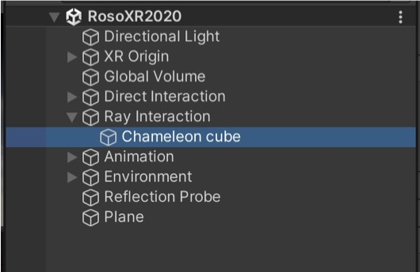
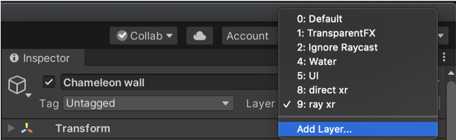
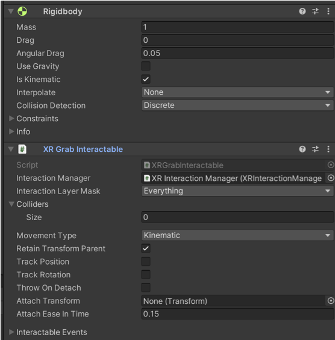
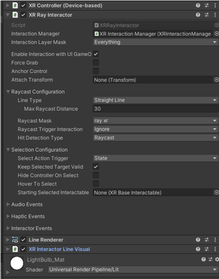
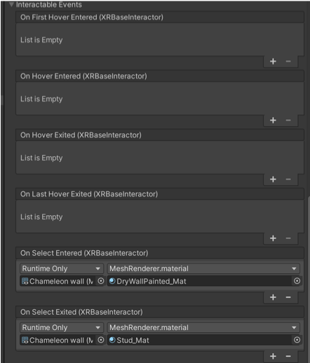

#VR recipe 4 - chameleon wall (left hand)
The <b>chameleon wall </b>shows you how to use the &lt;XR Ray Interactor&gt; to change a material from a distance (as a remote control)<b>. In the hierarchy, find for the <b>chameleon wall</b>.

1. The chameleon wall is a 3D cube in the shape of a wall. You need to set a layer so only certain object will interact using &lt;XR Ray&gt; Interaction. Click on the menu next to layer and select ‘Add Layer’. Then add a layer 8 and call it ‘direct xr’ and a layer 9 and call it ‘ray xr’.

2. The next step is to add an &lt;XR Grab Interactable&gt; on the wall so we can interact with it. Interaction doesn’t mean moving something, it can be static. In order to make it static turn on the ‘Is Kinematic’ and turn off ‘Use Gravity’. Also, since it’s not moving, we can set the &lt;XR Grab Interactable&gt; Track Position, Rotation and Throw on Detach to off (0). Finally add a &lt;Box Collider&gt;.

3. Since we use the right hand for direct interaction, we can use the left hand for &lt;XR Ray&gt; Interaction. The VR Ray is specific to VR as it allows you to interact with object at a distance. In our case, we use it as a <b>remote control</b> so we will turn off the Force Grab and Anchor Control. The <b>Raycast Mask</b> cast needs to be set to ‘ray vr’ to limit the objects we can use. The &lt;XR Ray Interactor&gt; also requires the &lt;Line Renderer&gt; and the &lt;XR Interactor Line Visual&gt; so you can see where you are aiming at. 

4. Finally, in order to change the materials, go back to the chameleon wall, check the &lt;XR Grab Interactable&gt; and look for the On Select Entered event. Click on + then drop the chameleon wall object, then choose MeshRenderer then MeshRenderer.material and drop a material of your choice (DryWallPainted is from the URP example scene).

On Select Exited event. Click on + then drop the chameleon wall object, then choose MeshRenderer then MeshRenderer.material and drop a material of your choice (Stud_Mat is from the URP example scene).

Now you should be able to change the material of the wall by pointing the ‘laser’ towards the wall. If you want more interaction, like changing more material, you will have to write your own code.
