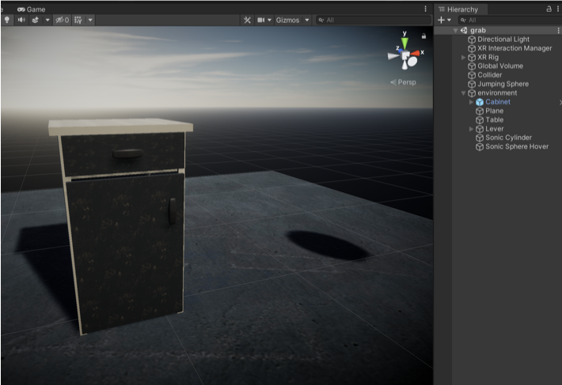
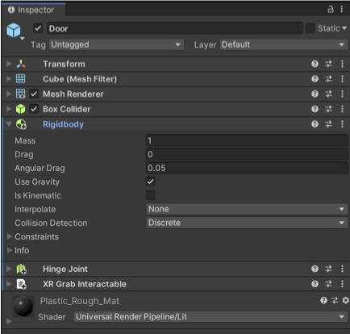
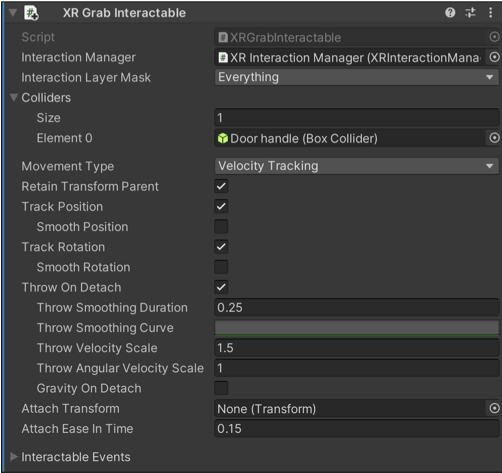
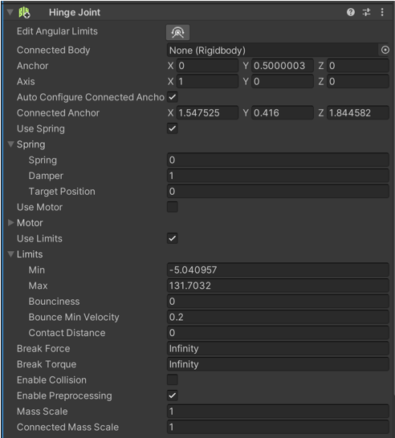
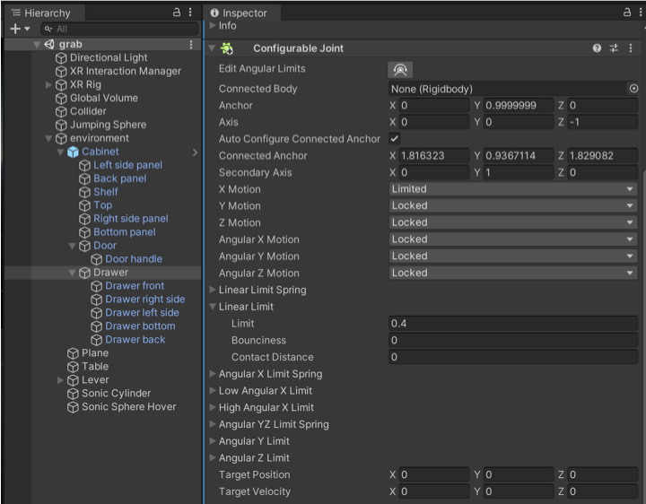
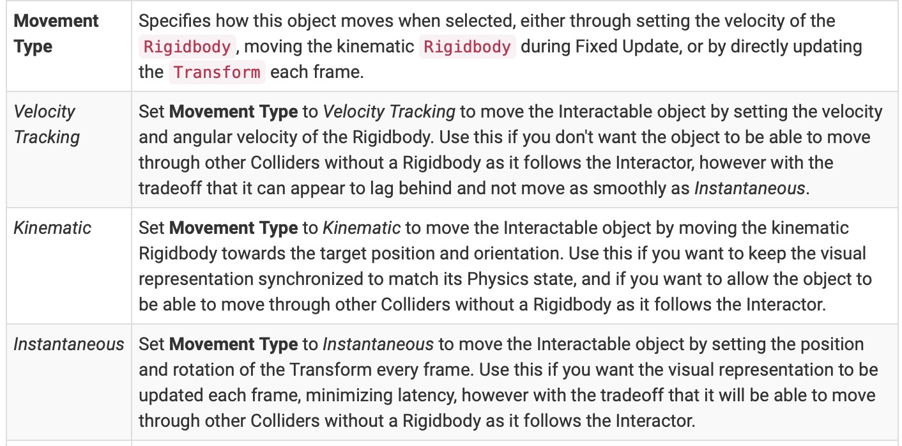

# VR recipe 4: Door and Cabinet Using Unity Physics

The cabinet is a simple object that shows the use of hinges (doors) and configurable joints (drawers, sliding doors). Find the example in the RosoVRgarden OpenXR project project (<a href="https://github.com/RosoVRgarden/RosoVRgarden_OpenXR22">https://github.com/RosoVRgarden/RosoVRgarden_OpenXR22</a>) and look for the <b>cabinet</b> in the hierarchy:the door </b>to get started. It includes a &lt;Rigidbody&gt;. Make sure that there is a collider attached to your object. It’s also a good idea to have handle, make sure that it is a <b>child of the door, </b>has a collider and not static as it moves.

In the &lt;XR Grab Interactable&gt;, select <b>Velocity Tracking</b><i> </i>in the Movement type (see point 4) as it tracks the movement with with hinges using the physics engine. Finally, you need to add a collider in Colliders (change size to 1) and drag the <i>Door handle</i> into the Element 0 as it is the object that connects to your hand.

2. Next step is to select the door and add a &lt;Hinge Joint&gt; component. Click on the <b>Edit Angular Limit</b> to select where it is attached to (where would you normally put the hinges). Click use <b>Limits</b> to select what angles they should be open to (the limit is -180° to 180° but 0° to 90° makes more sense). The <b>Axis</b> is the plane on which your object is rotating (X axis is set to 1 to rotate around the X axis). The <b>Anchor</b> can be changed if Unity hasn’t found the edge of your door on its own. Use <b>Spring</b> option allows your to add some <b>Damper</b> and make the door feel heavier.

3. The <b>drawer</b> is a little bit more tricky as it is a sliding mechanism (like sliding doors). You will also need to add &lt;XR Grab Interactable&gt; component to get started and select <i>Velocity Tracking </i>in the Movement type as it tracks the movement with more precision (using the data from the physics engine).

You can simulate a drawer using the &lt;Configurable Joints&gt; component. then change the <b>X Motion</b> (if you are moving in the X axis) to limited and others to locked if you want to move in one axis only. The next things is the <b>Linear Limit</b> which stops you moving the drawer (0.4 in this case), moving it according to your requirements.

4. More. The Movement Types are important in virtual reality as they are about the right use of resources in your project. Velocity Tracking is for grabables objects that require more precision (physics), kinematic offers a good representation but is less precise and instantaneous is the least precise as it moves through colliders. Use Velocity Tracking for doors and other related object and Kinematic for the rest of your project.

