# VR recipe 6 - presence sphere (animation and programming)</b>

The presence sphere is an example shows how to make an animation that responds to the presence of the ‘player’. We have a collider (orange) and a Jumping sphere (silver). It is useful for making automatic doors. Look for the <b>presence sphere</b> in the hierarchy:

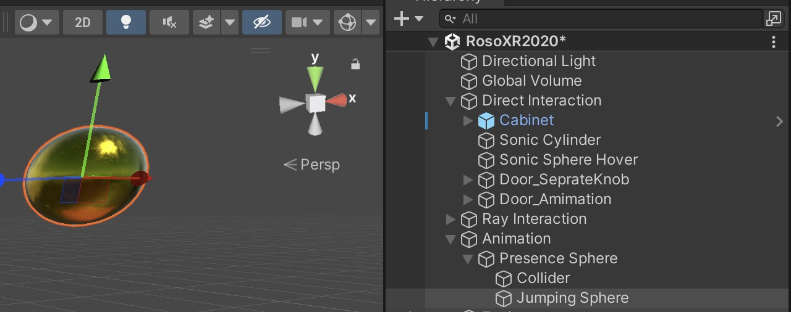

1. First we need to animate our jumping sphere. Select the sphere then go to Window &gt; Animation &gt; Animation.  

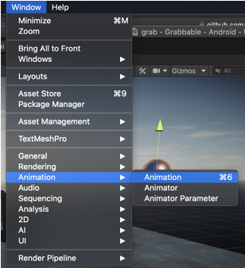

2. Click ‘Create’ in the middle of the screen and save the animation as ‘jumping’. Then click add property on the left side and click the + sign next to position. 

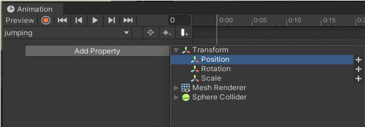

3. Click on the record button (red circle), select a time then change the position of the sphere.

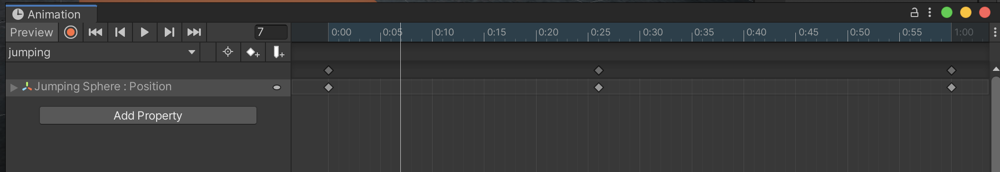

4. Looking at the assets, you should have your animation (‘jumping’) and the animation controller (‘Jumping Sphere’). Open the animation controller.

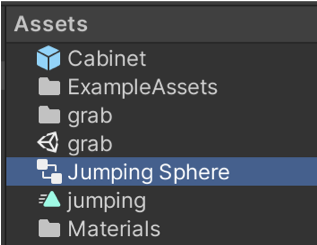

5. In this configuration, the animation will start immediately after entering the project (Entry -&gt; jumping), it’s not what we want.

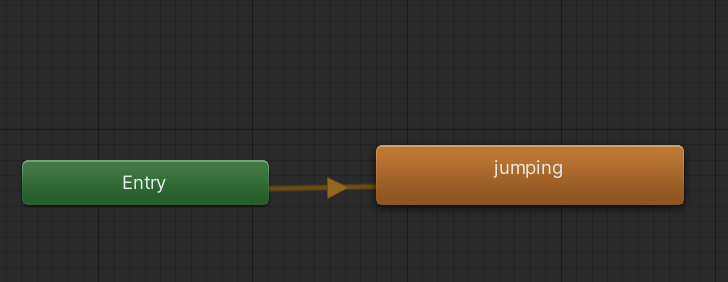

6. Right click in the grey area and select Create State &gt; Empty. Then Set this layer as Default State.

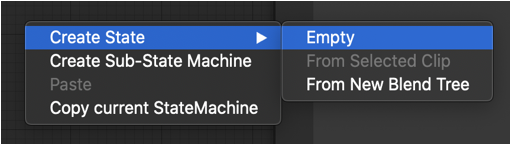

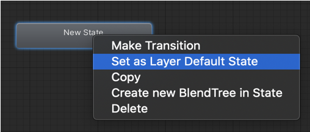

7. Now make transitions between the New State and the ‘jumping’ animation (right click on New State then on ‘jumping’, select make transition)

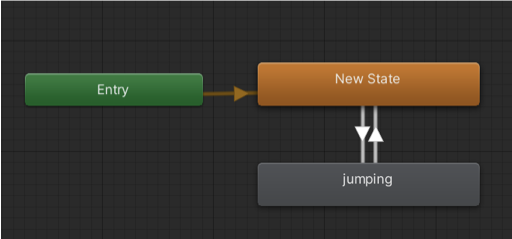

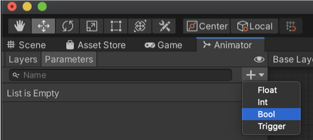

. Now we need to give a name to this so we can access it from our program. Click Parameters, then on the + sign, then select Bool (boolean are true or false). In the Name, call it ‘Jump’.

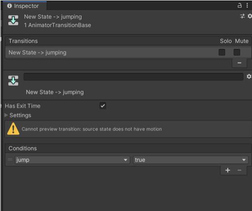

9. Select the transition going from New State to jumping, go to the inspector and click on the + sign under Conditions. Set jump to true (in other words <i>if jump = true, play the animation</i>)

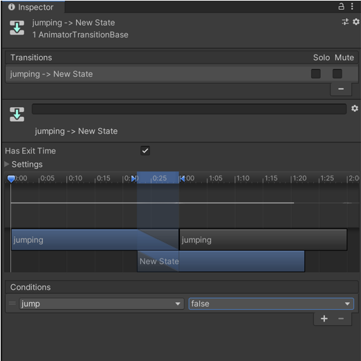

10. Select the transition going from jumping to New State, go to the inspector and click on the + sign under Conditions. Set jump to false (in other words <i>if jump = false, stop the animation</i>
	

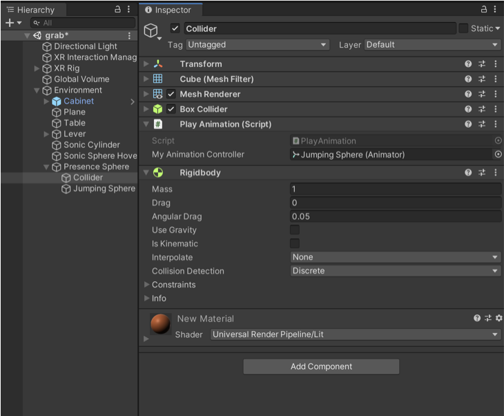

	
11. Now select the collider in the hierarchy (a simple plane with a box collider and Rigidbody with no gravity so it doesn’t move) and add a script component called PlayAnimation.

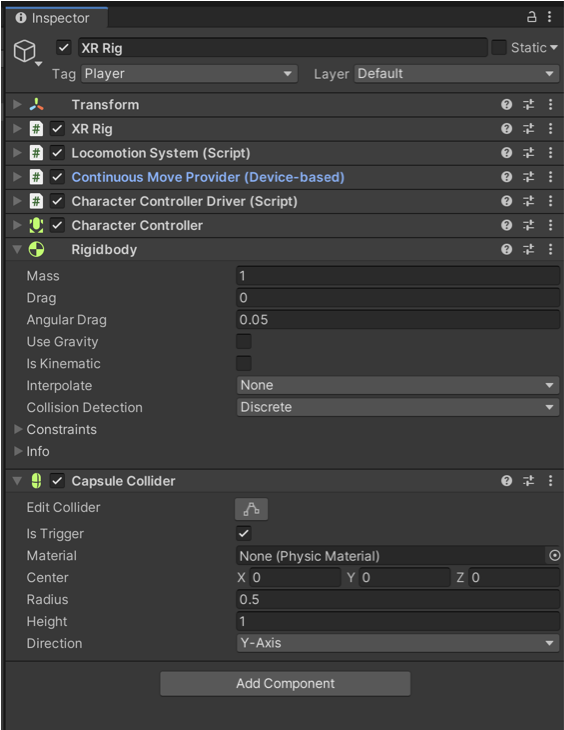

12. Copy the following code

	using.System. Collections;
	using.System. Collections. Generic;
	using.UnityEngine;

	public class PlayAnimation: MonoBehaviour
	{
		public Animator myAnimationController;

		private void OnTriggerEnter (Collider other){

			if (other. CompareTag ("Player")) {

				myAnimationController.SetBool("jump", true);
				print (" jump...");
			}
		}

		private void OnTriggerExit(Collider other){

			if (other. CompareTag ("Player")){

				myAnimationController.SetBool("jump", false);
				print ("jump...");
			}
		}
	}

13. Final step is change the tag on the XR Rig’s tag to Player (so when it hits the collider, it will respond) and add a Rigidbody (remove gravity) and a capsule collider with a trigger on so when you collide, you will send a message to your program.

