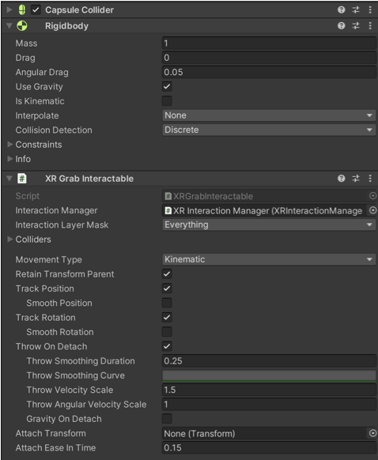

#VR recipe 7 - Sonic Sphere Hover: Interactable (programming)
The Sonic Sphere Hover is similar to the Sonic cylinder. It is an object that has physical properties (rigibody) and that plays sound if you hover around it with your VR hands. You could easily do the same with the Sonic cylinder technique but I want to demonstrate the use of programming. Find the <b>Sonic Sphere Hover</b> in the hierarchy.

1. It’s exactly the same as recipe 3. Create a 3D game object (a sphere this time) then add &lt;XR Grab Interactable&gt; component to get started. It should automatically install a &lt;Rigidbody&gt;. You can choose to have gravity (to fall) or be kinematic (to stay in the air). Test it !

2. Add a &lt;Audio Source&gt; component then import an <i>AudioClip</i> in your assets (I recommend sounddogs.com for reasonably priced professional sounds). Once the sound is in your assets, drag it to the <i>AudioClip</i> (see parasite). Make sure that <i>Play on Awake</i> is off.

3. Add a script component, type &lt;AudioGrabColorChanger&gt;

	using UnityEngine;
	using UnityEngine.XR.Interaction.Toolkit;

	// XRBaseInteractable - OBJECT

		public class AudioGrabColorChanger : MonoBehaviour
		{
			private XRBaseInteractable interactable = null;
	
			AudioSource audioData;
	
			private MeshRenderer meshRenderer = null;
			private Material originalMaterial = null;
			public Material selectMaterial = null;

			private void Awake()
			{	
				meshRenderer = GetComponent<MeshRenderer>();
   				 originalMaterial = meshRenderer.material;
		
     			interactable = GetComponent<XRBaseInteractable>();
     		   interactable.onHoverEntered.AddListener(StartAudio);
     		  interactable.onHoverExited.AddListener(StopAudio);	
		  }

		  void Start(){
			  audioData = GetComponent<AudioSource>();
			  audioData.Play(0);
			  Debug.Log("started");	
		  }

		  // hoverEntered and hoverExited	

		  private void OnDestroy()
		  {	
			  interactable.onHoverEntered.RemoveListener(StartAudio); 
			  interactable.onHoverExited.RemoveListener(StopAudio);
		  }
		
		  private void StartAudio(XRBaseInteractor interactor)
		  {
			  meshRenderer.material = selectMaterial;
			  audioData.UnPause();
		  }

		  private void StopAudio(XRBaseInteractor interactor)
		  {
			  meshRenderer.material = originalMaterial;
			  audioData.Pause();
			  Debug.Log("Pause: " + audioData.time);	
		  }
	  }

A few explanations:
AudioSource audioData;
AudiSource is the audio component where you put the audioData

MeshRenderer meshRenderer 
Meshrenderer is the componenent that let you change the colour.

Material originalMaterial
The current material
