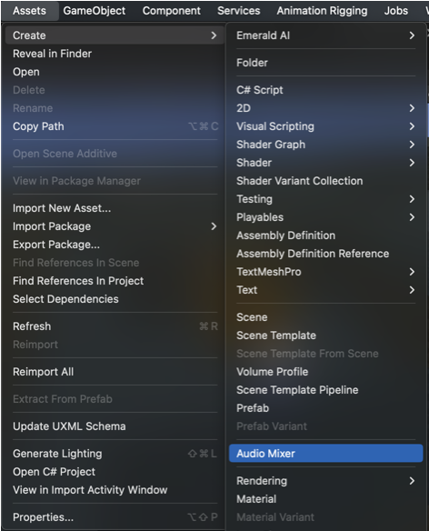
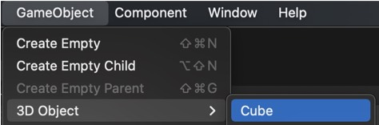
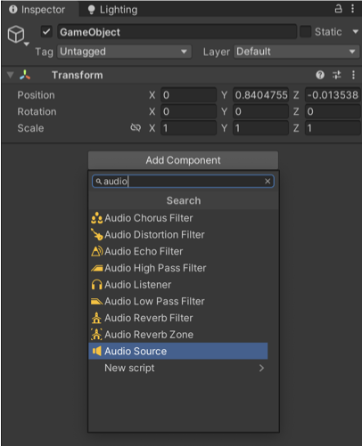
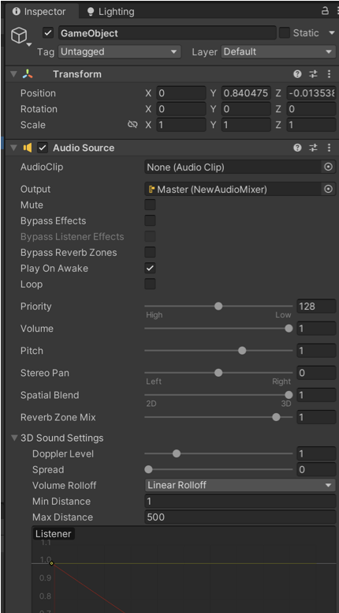
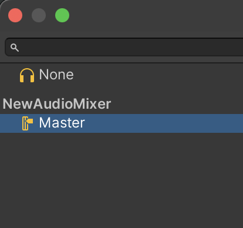

# VRgarden tutorials - VRgarden - Adding sound

## Introduction

1. Create an Audio Mixer for your project (you only need one)

Go to Assets &gt;  Create &gt; Audio Mixer

2. Create an empty GameObject &gt; Create Empty

3. Add a component to the GameObject: Audio Source

4. Import and choose your AudioClip, decide to <i>Play on Awake</i> (off if you trigger the sound through programming) and <i>Loop</i> the sound. For VR, move <i>Spatial Blend</i> to 1 and define the <i>Max Distance</i> (500 is for a background sound, are you using a smaller sound?)

5. In the Output of the Audio Source, choose Master (that’s your Audio Mixer).

