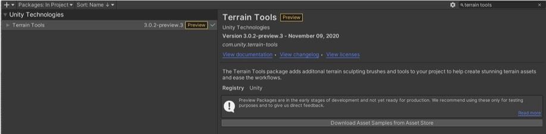
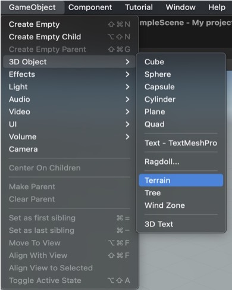
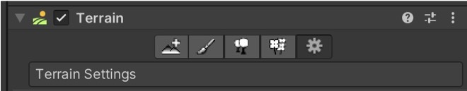
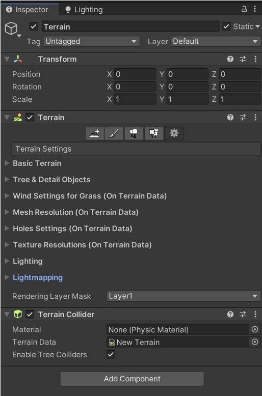
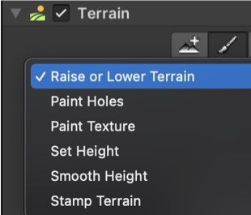
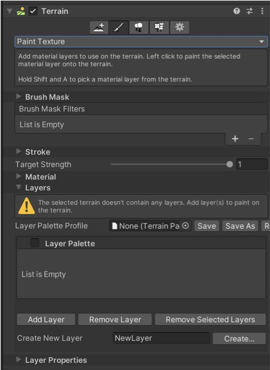
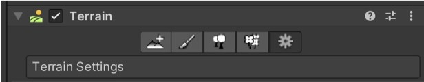
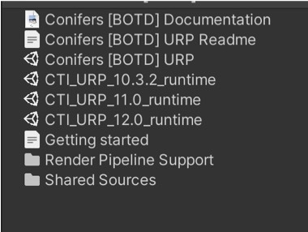
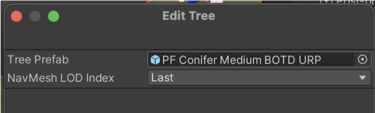
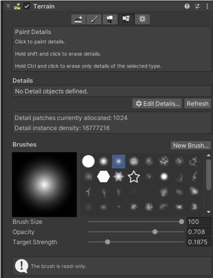

# VRgarden tutorials: Basic Terrain

It’s a good idea to start your project with a terrain if you plan to use grass, trees or plants, they will be optimised for speed. It is not advised to import your own trees as they won’t be optimised. Gaia Pro or Microverse are good alternative for better quality / complex terrain or flexibility with many more options but also with its own learning curve.

1. Download some assets;
- Outdoor Ground Textures
- Conifers (BOTD)
- Grass Flower Pack

2. Look at Unity Demo: Unity Terrain - URP Demo Scene (Free)

In the Unity Registry, download the <b>terrain tools</b>. If they don’t appear, click the + sign and write com.unity.terrain-tools. Click on Install then Click on Download Asset Samples to get more brushes. Click on Open in Unity then Import when it brings you back to the package manager.

3. Before starting, turn ON the Light <b>in the scene</b> and Toggle the Skybox / Fog / Fx OFF.

4. Create a Terrain. The Tree under is tempting but it doesn’t work well.

4. The Terrain interface allows you to create neighbours terrains, paint your terrain, paint trees and paint details (grass and plants).

5. Click the last one, <b>Terrain Settings</b>. In the Mesh Resolution, you can change the Width and Length of the Terrain (1000 x 1000 by default).

6. Select the Terrain in the interface, then select Raise or Lower Terrain. Choose a brush (irregular one), a brush size (remember your terrain is 1000) and the opacity.Shortcut: click to raise and shift-click to lower.

7. With the new <b>terrain tools</b>, you can also set the height (100 for example) and click flatten tile to flatten your terrain if you need it.

8. Shortcuts: 
<b>a</b> <i>strength the brush</i>
<b>s</b> <i>size of the brush</i>
<b>d</b> <i>rotate the brush</i>

9. Go back to the menu and choose <b>Paint Texture</b>. Go to Layers and Add Layer.

Choose any layers or <i>Grass_Moss</i> for example. You can double click on the name of the layer to change some of the parameters such as the normal. You want to zoom in on the texture to see the actual result.
	
10. You can create you own layer in the <b>Create New Layer</b> option below such as the <i>Ground Plant</i> from one of the packages you have installed at the beginning.

Select the material in the Assets and manually add a Normal Map and change some of the other parameters.

11. At this point, it’s a good idea to create a guide. Create a Cube and set the height to 2m.

12. In order to create a path, create a new New Layer option below from the ground9_diffuse texture. Also add a normal map. Use the brush to create a path on top of the grass.

13. <b>To add trees</b>, click on the tree section (under Terrain) and click Edit Trees then select Add Tree.

If the trees are all pink, then you need to open the package with URP trees. For the Conifers Trees, go to Assets folder &gt; Conifers and double click on the <b>Conifers URP</b> (and the <b>CTI_URP_11 runtime</b> - for Unity 2020 or CTI_URP_12 runtime - for Unity 2021). You can then delete the Built-in RP folder.

14. Choose a Conifer such as PF Conifer Medium BOTD URP and click Apply.

15. Use the brush to add and remove (shift) the trees or the mass place tree option if you want trees all over your terrain (Tip: select the same type of tree to be able to remove them).

15. <b>To add Grass or Plants</b>, go to the next section under the Terrain, the paint details section. Click the Edit Details… button. You can either add Grass texture and Detail Mesh. Choose the Grass texture and choose Grass 2 for example. Put some grass with the brush then change the colour by going back to the Edit Grass Texture. Finally change the settings to min 0.5, max 1, min 0.2 and max 0.5 to make it more subtle.

16. Choose other types of grass and some flowers.
	
17.Finally, the Grass Mesh id not as optimised as the Grass Texture but will give excellent results. Use Grass Medium and Small, for example.

18. Explore other tools in the RosoVRgarden such as Gaia Pro (templates) or Microverse (more flexible). The Vegetation Engine is also great to create smaller green areas.

