# VRgarden tutorials: Water Effects

There are many ways to create water in Unity. Is it a puddle, a small piece of water, a river, a lake or an ocean? It is recommended to use different pieces of softwares for different sizes of water. As an effect, it’s a particularly complicated one to render and since VR is a very constrained technology, it’s can be tricky to make water work. One important setting to check is the Render Mode (Edit &gt; Project Settings &gt; XR Plugin Management). The Single Pass Instanced is recommended as it is the fastest but if you can’t see the water in your headset, try Multi pass. Although it creates big files, consider Gaia Pro to create a complete environment with terrain and water. It works very well in VR and has underwater effects (see the Gaia Pro recipe).

## River and Lake

A good and easy tool is R.A.M - River Auto Material 2023. Once you have imported the package, go to the NatureManufacture Assets&gt;River Auto Material&gt;HD and URP Support Packs folder<b> </b>and install the <b>URP package</b> to make it compatible with URP.

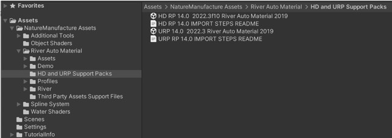

2.1 You want to have a terrain before you get started. Once it’s done, go to GameObject &gt; 3D Object &gt; Create a River Spline (or a Lake Spline). In order to add points, use <b>CTRL + click on Left Button</b>. You can remove them using CTRL + SHIFT + click on Left Button and if you want to add a point in between, use SHIFT + click on Left Button. If you make lake, just make sure that you close your circle.

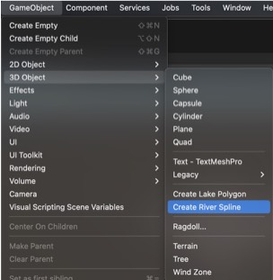

2.2 The material will be pink at first but when you have finished shaping the river, you can add a water profile. Go to NatureManufacture Assets&gt;River Auto Material&gt;River Profiles and drag a profile to the Spline Profile in the Inspector. I used <b><i>R2_Profile_River_Mountain</i></b>.

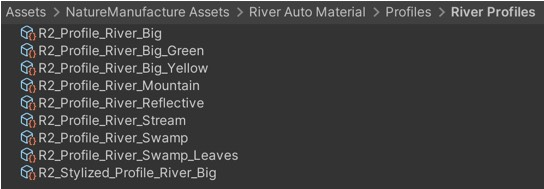

2.3 You have many other options such as the the River width (it can be changed for a specific part of the river in the Points Tab) or the UV (the resolution and the direction of the texture). An interesting option is the Snap/Unsnap mesh to the terrain so the river follows the shape of the terrain.

## Ocean
The best looking water is <b>KWS Water System</b> where you can create underwater effect and underwater buildings. If there is an issue, you can use the Crest Water System. It is recommended to look at the examples in the Crest-Examples folder such as the River and Lake one as it is more difficult to setup. You will also need to have a terrain to work properly.

3.1 Setting up <b>KWS Water</b>. In order to get transparency on the Ocean, you should activate the <b>Depth Texture</b> and the <b>Opaque Texture</b> in the URP Setting. Go to the Project Settings, choose Graphics and click on URP-HighFidelity. 

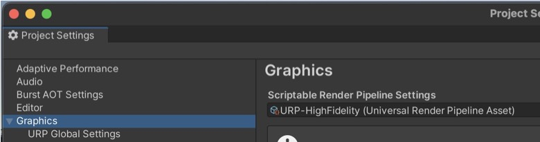

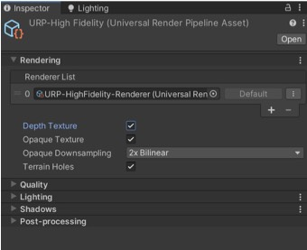

3.2 Create an Empty 3D Object, reset the transform and add a component called <b>Crest Ocean Renderer </b>(see Water in the inspector). If you want to create a river, create another empty 3D Object to which you will add the Crest Spline component (see River).. Add a few points (they will place themselves in a line) then click Set Height, Add Flow and Add Wave in the inspector. You can also change the width of the river by selecting the splines directly in the hierarchy. The Lake is not much different as the splines need to close. Look at the Spectrum for any differences between the two.

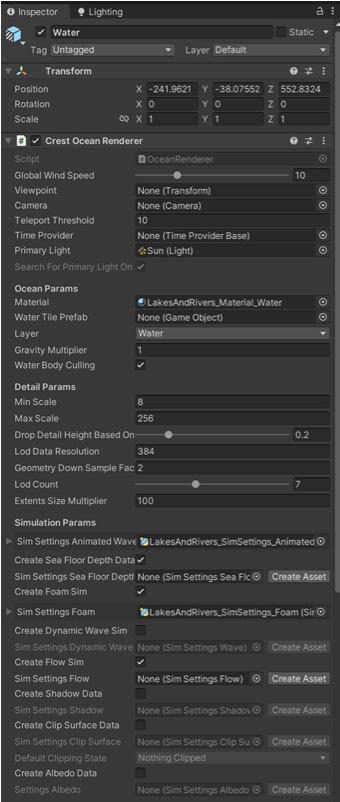

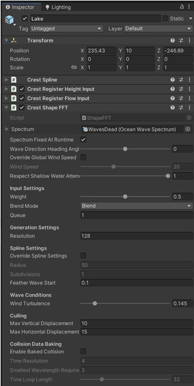

3.3 Create a third Empty 3D Object (Waves) and add Crest Shape FFT to make waves.

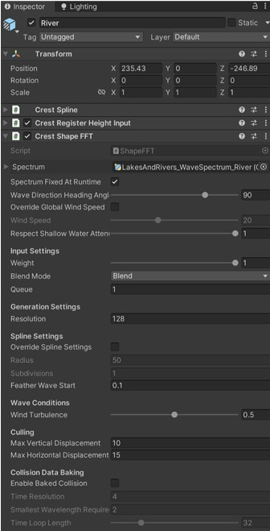

3.4 Finally, you can add some underwater effect by adding the Crest Underwater Rendered in the camera (need testing in VR).

## Underwater Effect

KWS or Gaia Pro have good underwater capabilities. If you are looking to create a good underwater effect or add to the realism of your water, look for the caustic effect (see below). You can use <b>Water Caustics Effect for URP v2</b>. It is compatible with URP and give you a variety of renderings.

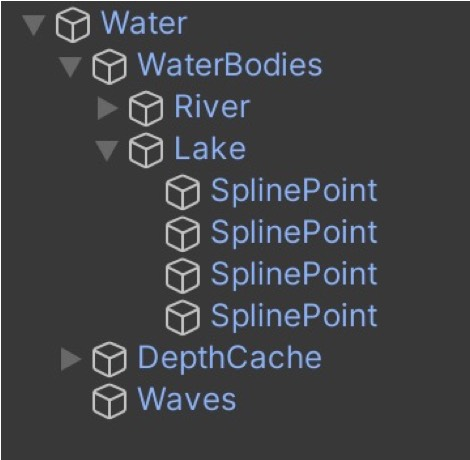

4.1 After installing the package, go to GameObject &gt; WaterCausticsModules&gt;TexGen and Effect.

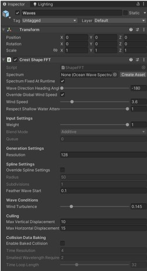

4.2 The TexGenerator is the main element as it generates the caustics animated texture. You can change the scale in the transform, change the resolution, the waves / style.

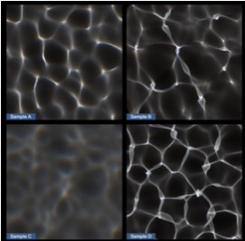

## Small piece of water

URP Water is an easy to use water. First you need to set the Depth Texture and the Opaque Texture as in the previous examples.

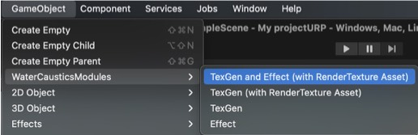

5.1 You need to create a material (+ sign, near the Assets) and choose URP Water&gt;Standard in the list of shaders. Play with the options and look at the demo. In the mode, the flow is an interesting way to create movement in the water. The reflexion can come from many places, use a reflexion probe as it is the easiest. The foam shows around the object that intersects with the water and the caustic is similar to the caustic effect seen earlier (only simpler).

## Add life to your water
You can add life to your water by adding fish, such as the [Fish School Bundle](https://assetstore.unity.com/account/assets) or [corals](https://assetstore.unity.com/packages/3d/vegetation/plants/corals-153595)

## More information

RAM 3 - <a href="https://www.youtube.com/watch?v=VI7CiHcemzU">https://www.youtube.com/watch?v=VI7CiHcemzU</a>

Crest User Manual: <a href="https://crest.readthedocs.io/en/stable/user/initial-setup.html?rp=urp">https://crest.readthedocs.io/en/stable/user/initial-setup.html?rp=urp</a>

KWS Water System: <a href="https://www.youtube.com/watch?v=8_NSuJBELus">https://www.youtube.com/watch?v=8_NSuJBELus</a>

Water Caustics Effect for URP v2: <a href="https://www.youtube.com/watch?v=0R-_6YSN31s">https://www.youtube.com/watch?v=0R-_6YSN31s</a>

Water Caustics Effect Manual: <a href="https://hacoapp.com/asset/wce/v2/ManualPDF.pdf">https://hacoapp.com/asset/wce/v2/ManualPDF.pdf</a>

URP Water manual: <a href="https://yvgrafix.bitdocs.ai/share/d/NT0HV9q9FpgCZJZI">https://yvgrafix.bitdocs.ai/share/d/NT0HV9q9FpgCZJZI</a>

